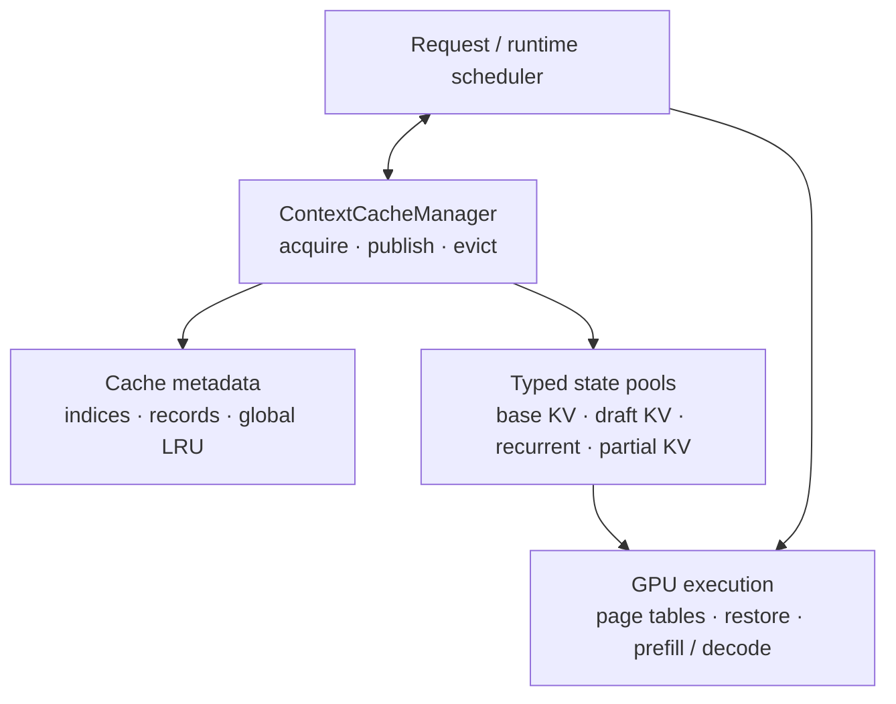
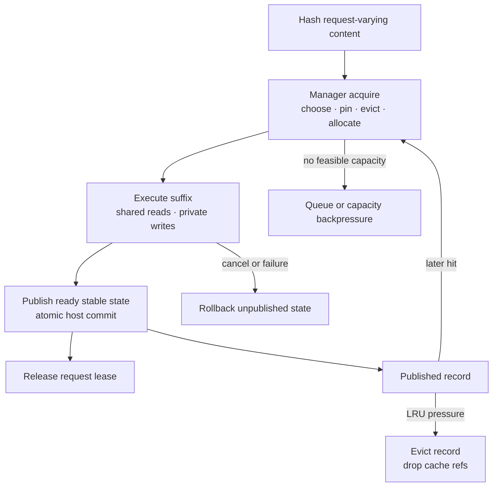
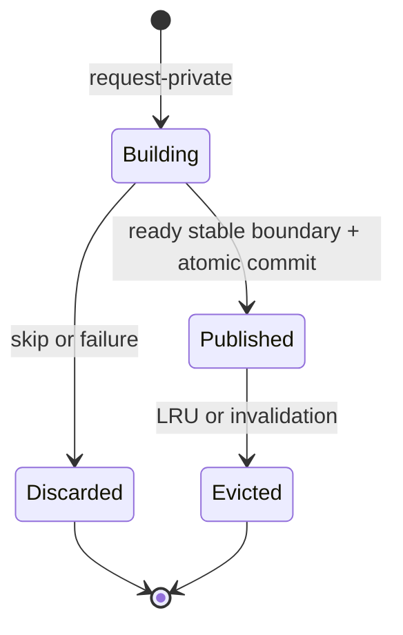

<!--
SPDX-FileCopyrightText: Copyright (c) 2025-2026 NVIDIA CORPORATION & AFFILIATES. All rights reserved.
SPDX-License-Identifier: Apache-2.0

Licensed under the Apache License, Version 2.0 (the "License");
you may not use this file except in compliance with the License.
You may obtain a copy of the License at

http://www.apache.org/licenses/LICENSE-2.0

Unless required by applicable law or agreed to in writing, software
distributed under the License is distributed on an "AS IS" BASIS,
WITHOUT WARRANTIES OR CONDITIONS OF ANY KIND, either express or implied.
See the License for the specific language governing permissions and
limitations under the License.
-->

# Production Context Cache Architecture and MR3 Design

| Field | Value |
|---|---|
| Status | Normative MR3 integration baseline; later extensions are labeled explicitly |
| Date | 2026-07-22 |
| Integration destination | Formal integration into `main` |
| Scope | Single-device, text-only TensorRT Edge-LLM runtime |

[TOC]

## 1. Overview and scope

### 1.1 Problem and design thesis

Multi-turn and branched requests repeatedly evaluate histories whose model
state may already be resident on the device. The redundant work increases time
to first token.

The context cache is a **process-local, content-addressed store of immutable
model-execution checkpoints**. A request leases compatible state, computes its
uncached suffix in private storage, and may atomically publish new stable state
for later requests. Published records outlive requests and are evicted as
logical ownership units under memory pressure.

This is not a conversation database. One runtime owns one fixed loaded
deployment, and correctness within that boundary comes from token and
request-varying state identity rather than a session id. A future session API
may provide history storage or lookup hints without replacing content identity.

### 1.2 MR3 decisions

| Area | Decision |
|---|---|
| Device | One runtime device; no distributed coordination |
| Storage | Startup-preallocated typed pools with on-demand page assignment |
| Ownership | Independent `activeRefCount` and `cacheRefCount` |
| Eviction | One global sequence-record LRU |
| Acquisition | One serialized manager call chooses reuse, pins hits, evicts, and allocates |
| Publication | Request-owned capture and synchronous atomic host publication at existing readiness points |
| Attention | Full pages only; full configured allocation for SWA |
| Hybrid | Exact atomic KV plus recurrent/convolution checkpoint |
| Speculative decode | Greedy non-hybrid EAGLE with paired base/draft matching and one-full-page replay |
| Input | Text-only; multimodal and audio reuse are follow-up work |
| Compatibility | One context-cache-enabled runtime and its fixed deployment form the compatibility boundary |
| Numerical behavior | Exact snapshot copies; model/precision accuracy tolerance end to end |

### 1.3 Supported matrix

Reuse is default-off. Current-toolchain engine ABI validation runs for every
runtime; disabling reuse does not waive artifact compatibility. The additional
deployment gates below run during cache-enabled runtime construction and fail
closed before any request is served.

#### 1.3.1 Deployment admission

| Deployment kind | Condition | Reuse form |
|---|---|---|
| Vanilla | Attention layers only, no speculative role | Page-granular longest-prefix KV reuse; a hit never requires reaching a record endpoint |
| Pure recurrent | Recurrent layers only | Exact recurrent/conv checkpoint; no KV pages |
| Hybrid | Attention + recurrent layers | Exact atomic checkpoint: KV prefix + recurrent/conv state (+ partial-KV tail) |
| EAGLE | Greedy EAGLE base + draft, both attention-only | Paired base/draft path from one producer record; one-full-page replay |

An EAGLE deployment serves both request modes: EAGLE-decoded requests require
a paired base+draft hit, while requests executed through the vanilla fallback
decoder (for example non-greedy sampling) reuse the base side only.

Every current-toolchain attention engine, independent of the reuse toggle,
contains the `kv_page_table` INT32 input with exact
`[batch, 2, maxPagesPerSeq]` optimization profiles. Pure-recurrent engines are
exempt because they have no KV pages.

#### 1.3.2 Rejected at cache-enabled startup

- Speculative modes MTP, DFlash, DSpark, and Gemma4 MTP; hybrid EAGLE
- Block Diffusion backbones
- Multimodal deployments: any vision, audio, or action runner (reuse is
  text-only), and engines using vision-bidirectional attention
- KV cache dtype other than FP16; KV pool geometry below the full-allocation
  floor
- Invalid cross-layer KV-sharing donor topology (chains, cycles, or mismatched
  donor/recipient layouts)
- EAGLE drafts without an independent KV cache, without a base-owned
  conditioning-layer contract, or with a mismatched conditioning hidden size

Admitted and explicitly supported: sliding-window attention layers (SWA is a
read-time kernel mask over the full physical allocation, so cached pages stay
valid when rebound across requests) and engines with validated cross-layer
KV-sharing donors.

#### 1.3.3 Per-request behavior on an admitted deployment

| Request property | Behavior |
|---|---|
| Text generation, vanilla or greedy EAGLE | Full lookup and publication |
| Non-greedy request on an EAGLE deployment | Vanilla fallback decoder; base-side reuse only |
| Explicit bypass lookup policy, audio-generating request, or Thinker-embedding-exporting request | Managed private pages; no lookup, no publication |
| LoRA adapter | Supported; the adapter identity is part of every block key, so adapters never cross-hit |
| Commit policy | Including generated tokens (default) or prefill-state-only |
| Cancelled or errored slot | Never published |
| Multi-sequence batch | Supported, including mid-request eviction compaction |

#### 1.3.4 Platform constraints

- Single-device runtime by construction; no multi-device or tensor-parallel
  coordination exists in this runtime.
- Process-local cache: no persistence, host offload, or cross-process sharing.
- One enabled runtime is one trusted cache domain (single tenant); isolation
  requires separate runtimes.
- Requests are serialized end to end; the coordinator is single-request.
- Weight and activation precision is unconstrained (for example NVFP4/FP8
  checkpoints); only the KV cache dtype is pinned to FP16.

Runtime, engine, and sidecar artifacts form one current-toolchain contract.
Compatibility with artifacts produced by earlier runtime, exporter, builder, or
plugin versions is outside the support boundary.

The cache does not create model combinations that the no-reuse runtime cannot
already execute.

### 1.4 Goals and non-goals

MR3 must:

- reuse prompt and committed generated-token state without a session id
- support branching histories and independent branch eviction
- manage base KV, draft KV, recurrent state, and partial KV coherently
- coexist across base-model and LoRA adapter generations
- guarantee resources for every admitted active request
- expose hits, replay, publication, pressure, and eviction through metrics

MR3 does not include:

- persistence, host swap, active preemption, or multi-device coordination
- pure-attention partial-page reuse or SWA window-aware reclamation
- hybrid EAGLE, MTP reuse, DFlash reuse, or non-greedy EAGLE
- multimodal or audio sequence/artifact reuse
- request-level tenant partitioning; separate runtimes provide isolation
- periodic recurrent capture intervals
- one-token EAGLE replay
- cached logits, sampler/RNG state, or base-hidden bridge
- identical-checkpoint continuation without a new token to prefill
- tree-aware ownership or subtree eviction

### 1.5 Architectural invariants

1. Published state is a pure function of all state-producing key material.
2. Published pages and snapshots are immutable; recompute and snapshot restore
   write request-private storage.
3. One serialized manager acquisition chooses reuse and pins it before another
   cache metadata mutation can occur.
4. Acquisition either returns one complete lease or leaves no lasting mutation.
5. A checkpoint becomes visible only when every required resource is ready and
   cache-owned.
6. A physical resource is free only when both active and cache refs are zero.
7. Misses use an explicit semantically valid path; unsupported cache-enabled
   deployments fail closed and never consume incomplete state.

## 2. Conceptual model and architecture

### 2.1 Terms

| Term | Meaning |
|---|---|
| Logical length | Complete token history known by the request |
| Resident length | Tokens represented by one named model state; EAGLE base and draft lengths may temporarily differ |
| Published length | Resident prefix visible to later requests |
| Full block | One immutable `pageSize`-token block eligible for block lookup |
| Partial tail | `residentLength % pageSize` tokens in a writable page |
| Compatibility boundary | One runtime and its fixed loaded deployment |
| Acquisition recipe | Reuse, replay, bindings, and new demand selected inside manager acquisition |
| Request lease | Active pins and private allocations owned by one logical request |
| Cache record | Published ownership and eviction unit containing a complete resource path |

### 2.2 Component organization



The coordinator owns request policy and GPU orchestration. The manager owns
cache metadata and resource ownership, not model computation. The runtime uses
the returned lease and bindings to update page tables, restore state, and
launch GPU work. Kernels do not make identity, ownership, or eviction decisions.

| Component | Responsibility |
|---|---|
| Identity and indices | Map logical prefixes within one deployment to ready published state |
| Context cache manager | Choose reuse, pin, allocate, publish, and evict transactionally |
| Cache record store | Own complete records, exact-record lookup, and global LRU |
| Typed pools | Own physical slots, dual refs, and free lists |
| Runtime and GPU paths | Bind/restore state and execute prefill, decode, and commit |

### 2.3 MR3 cache plane and future media plane

```text
SequenceStateCache:
    token prefix -> base/draft/recurrent model state

Future MediaArtifactCache (not part of MR3):
    media content -> encoder output and auxiliary metadata
```

MR3 implements only `SequenceStateCache`. A later media cache needs independent
identity, ownership, and eviction because an encoder artifact and a sequence
checkpoint have different lifetimes and reuse value.

## 3. Request and record lifecycle

### 3.1 Common request lifecycle



| Phase | State transition |
|---|---|
| Identify | Build the block chain and any candidate exact-prefix digests |
| Acquire | Choose reuse, pin hits, evict if required, allocate all typed demand, and return a lease atomically |
| Execute | Bind shared immutable state; write only request-private resources |
| Publish | After the existing stream readiness point, install ownership and indices atomically |
| Release | Drop remaining active ownership on success, cancellation, or failure |

`ContextCacheManager::acquireVanilla()` handles ordinary autoregressive reuse,
`acquireHybrid()` handles exact atomic recurrent/attention checkpoints, and
`acquireSpec()` handles the MR3 EAGLE path. Each method builds and consumes its
internal recipe under the same externally serialized manager call. Runtime
callers do not retain a plan across metadata mutations.

### 3.2 Ownership transitions

| Event | Active ownership | Cache ownership |
|---|---:|---:|
| Private allocation | `+1` | `0` |
| Cache hit | `+1` | unchanged |
| Successful publication | retained until lease release | `+1` before visibility |
| Request completion or failure | `-1` | unchanged |
| Record eviction | unchanged | `-1` |

When a resource loses its last cache ref, its lookup mapping is removed even if
an active request still owns it. The bytes remain valid for that request but
are not offered to new requests until republished.

### 3.3 Record lifecycle



Unpublished state remains actively pinned and is neither visible nor evictable.
Cache ownership and indices are installed before producer activity is released.

### 3.4 Stable publication and rollback

MR3 considers publication at prefill end and at coordinator-policy-enabled
decode end. Hybrid prefill snapshots are enqueued before the runtime's existing
stream synchronization and therefore add no readiness wait. A terminal
decode-end hybrid snapshot can only be selected after finish state is known, so
its capture is followed by one synchronous stream wait before host publication.
There is no pending-publication worker, task queue, or event-backed state. The
host canonicalizes duplicates, adds cache ownership, and installs the record
and all indices as one metadata transaction. Consumers never observe a partial
base/draft or KV/recurrent bundle. A manager commit returns
`PublishStatus::kPublished` for a new record or draft-state upgrade or
`kExistingRecord` for an existing endpoint.

Canonicalization preserves logical lineage rather than producer page-ID
lineage. A complete `BlockHash` includes its parent hash and non-token identity,
so equal hashes within one validated deployment identify interchangeable base
KV state for the same logical prefix. If a producer computed a private page
`P1` for a hash already mapped to canonical page `C1`, publication records
`C1`, keeps the unique `BlockHash -> PageId` mapping, and may continue with
descendants computed after `P1`. For example, producer path
`C0 -> P1 -> P2` may publish as `C0 -> C1 -> P2`. The lease is not rebound:
`P1` remains request-private and is released with the lease.

This projection remains page-level base matching, not record-level path
matching. An EAGLE draft path still comes from one coherent record, and a
hybrid checkpoint still matches one exact token boundary. Either may be
published atomically with the canonical base projection when it was computed
for that same logical hash chain and boundary.

`ContextCacheCommitPolicy::kIncludingGeneratedTokens` permits decode-end
publication. `kPrefillStateOnly` suppresses it when the next rendered turn is
not a token-exact extension of the generated stream. This policy belongs to the
coordinator: when publication is disallowed, it does not call the manager.
There is no manager-level policy-skip result.

The move-only `CacheRequestLease` is the single cleanup mechanism. It follows
the logical request across batch-slot remapping and releases every unpublished
pin or allocation on any early return. An already published prefill record
survives a later decode failure; unaccepted speculative writes never publish.
Manager and lease access remains under the same externally serialized
single-writer contract, and no lease may outlive its manager.

## 4. Common cache mechanics

### 4.1 Identity and lookup

Compatibility is established once when a context-cache-enabled runtime is
constructed. `validateContextCacheDeployment()` validates the fixed loaded
deployment and returns one small `ContextCacheDeploymentKind`:
`kVanilla`, `kHybrid`, `kPureRecurrent`, or `kEAGLE`. Validation rejects
unsupported topology, engine-role, state-layout, and backend combinations
before the runtime serves requests; physical bindings are checked after engine
load.

The coordinator stores that deployment kind, not runtime-generated
model-domain, draft-signature, or recurrent-schema tags. Engines and their
state layouts do not switch within the lifetime of this cache. Loading another
deployment creates another runtime and therefore another cache.

Attention lookup uses a 128-bit chained hash over complete token blocks:

```text
H[i] = hash(H[i-1], token block i, semantic extras)
```

The chained key shape follows vLLM's
[Automatic Prefix Caching](https://docs.vllm.ai/en/v0.14.1/design/prefix_caching/)
design: parent hash, block tokens, and semantic extras. This implementation
defines its own tagged, deterministic 128-bit FNV-1a identity. It does not reuse
`cpp/common/hashUtils.h`, whose `std::hash`-based `size_t` values are unordered
container bucket hashes backed by key equality; `BlockHash` is the content
identity itself and has no secondary token comparison.

Block extras carry request-varying state identity that the fixed deployment
does not imply: LoRA adapter id and generation, non-implied position data,
custom embeddings, media content and placement, and optional isolation
identity. MR3 is text-only, but the block key already has room for future
media integration. Sampler settings, output limit, stop strings, and response
format are excluded because they do not produce model state. MR3 accepts the
128-bit collision stance and does not retain full token equality data per block.

FNV-1a is deterministic and inexpensive, not cryptographic. Hash identity is
an accidental-collision contract, not an authorization boundary. MR3 therefore
requires one context-cache-enabled runtime/coordinator to serve one trusted
compatibility and isolation boundary. Separate runtimes are required when
requests must not share state.

LoRA uses `{adapterId, adapterGeneration}`. Adapter variants coexist. The MR3
runtime-local adapter registry is immutable after construction and therefore
uses generation zero; future hot replacement must advance the generation
instead of clearing unrelated cache entries.

The lookup shape follows state dependency:

```text
BaseBlockIndex:
    BlockHash -> basePageId

DraftPathIndex:
    terminalBlockHash -> set<{CacheRecordId, pathBlockCount}>

HybridCheckpointIndex:
    (exactPrefixDigest, exactLength) -> CacheRecordId
```

Base KV is canonicalized independently by complete logical block. Draft KV
is selected as one coherent record path because the last draft position in a
page depends on the first token of the next page. Hybrid state is indexed by an
exact token boundary because recurrent state at `L` cannot be reconstructed
from another length. Pure-attention lookup therefore needs no endpoint key.

Lookup has no recency or refcount side effects. If two requests publish the
same identity, first committer wins; the duplicate private state is released
and the existing record becomes MRU.

### 4.2 Acquisition

The public manager operations are `acquireVanilla()`, `acquireHybrid()`, and
`acquireSpec()`. Inside one serialized call, the manager chooses an executable
reuse boundary, pins every shared resource, simulates and applies any required
eviction, allocates the complete typed demand, and returns one lease. Its
returned recipe describes the selected reuse length, bindings, optional hybrid
restore, EAGLE full-page replay, and `ResourceDemand`.

`ReusePlanKind` still classifies the selected recipe as `kStandard`,
`kNoReusablePrefix`, or `kFullInputRewind`. `AcquireStatus` is either
`kAcquired` or `kInsufficientCapacity`; there is no exposed stale-plan state,
revalidation phase, or plan object retained by the runtime between manager
calls. Capacity failure returns no lease and leaves no lasting mutation.

`ContextCacheLookupPolicy::kUseCache` performs normal matching. `kBypass`
constructs an explicit cold demand without consulting lookup indices. If a
cache-derived hit is infeasible, the coordinator may make a separate bypass
acquisition. Cold acquisition may still evict retained records to make active
demand feasible; bypass disables lookup and publication, not cache-capacity
management.

Dynamic growth extends the same lease. Prefill allocates by chunk, vanilla
decode allocates before a boundary-crossing write, EAGLE acquires the complete
next proposal/verification demand, and hybrid restore acquires a writable
partial page before copying state.

### 4.3 Records and typed pools

```text
CacheRecord
  identity and logical block hashes
  complete base page path
  optional coherent draft page path
  optional recurrent snapshot slot
  optional partial-KV snapshot slot
  optional exact checkpoint length
  LRU state
```

A record owns its complete path, not only its terminal page. This makes branch
eviction correct without parent/child metadata:

```text
record X owns A-B-C       record Y owns A-B-D
cacheRef(A,B)=2           cacheRef(C,D)=1
evict X -> A/B remain; C becomes reclaimable
```

MR3 preallocates independent pools for base-KV pages, optional draft-KV pages,
recurrent snapshots, and hybrid partial-KV snapshots. Typed pools make layout,
alignment, and capacity proofs explicit. Future media artifacts require a
separate variable-size byte-bounded cache.

Each typed resource ID directly names one physical page or snapshot slot in
its pool. A recurrent slot covers all recurrent/convolution layers at one exact
boundary; a partial-KV slot covers the partial attention page across all
attention layers.

### 4.4 Capacity and allocation

Dynamic assignment does not weaken the active-set guarantee:

```text
poolCapacity >= maximum simultaneous active footprint for that pool

maxBasePagesPerRequest = ceil(maxSequenceTokens / pageSize)
                           + peakBaseTransientPages
basePoolPages >= maxBatch * maxBasePagesPerRequest

maxDraftPagesPerRequest = ceil(maxDraftStateTokens / pageSize)
                          + peakDraftTransientPages
draftPoolPages >= maxConcurrentEagleRequests * maxDraftPagesPerRequest
```

Transient demand includes overlapping verification/proposal writes, backend
spill, EAGLE full-page replay, hybrid partial restore, and full-input rewind.
Live recurrent state and execution buffers are separately allocated for
`maxBatch`; immutable snapshot pools are cache-only and best-effort.

Startup validation also includes weights, TensorRT contexts/workspace, live
state, all pools, and scratch in the device-memory total.
This aggregate check applies to discrete GPUs and Tegra shared memory.

Every allocation uses one all-or-nothing vector:

```text
ResourceDemand
  baseKvPages
  draftKvPages
  recurrentSnapshotSlots
  partialKvSnapshotSlots
```

Cache records may occupy all slack while requests are short. They are evicted
as active requests grow. A correctly configured admitted request must not fail
mid-generation because cached records consumed its future capacity. The caller
must not admit an active set whose validated maximum demand exceeds the pool;
hybrid capture reservation is best-effort and may be skipped before publication
when its snapshot pool is under pressure.

### 4.5 Global record LRU

Sequence-state eviction operates on records because base, draft, recurrent,
and partial state are valuable as coherent checkpoints. Physical pages are
still reclaimed at refcount granularity.

On shortage, acquisition simulates records from LRU to MRU. It decrements
simulated cache refs and counts a resource only when simulated cache refs and
real active refs both reach zero. A victim may reclaim nothing by itself yet
be necessary before a later victim drops the last shared reference. Mutation
occurs only after every resource type in the demand is feasible. Free-capacity
requests bypass the LRU walk.

New publication, exact duplicate, base-only record upgrade to EAGLE, exact hybrid hit,
and coherent draft-path hit promote the relevant record. A base block hit
does not promote every record that happens to share the block.

A confirmed coherent draft hit is treated as the effective MRU during eviction
simulation. The real LRU is touched only after acquisition is feasible, so a
failed acquisition still leaves no mutation.

`CacheRecordStore` intentionally uses flat records whose page paths are
vectors, not a radix tree. Complete-path cache refs already make branch
deletion correct; a tree would primarily improve prefix traversal and
leaf-first eviction policy, so it remains a later optimization.

### 4.6 Page-table and backend contract

Each base or draft attention layer uses a pool-shaped KV tensor and a shared
logical page table:

```text
layerKvPool: [2, numPages, pageSize, numKvHeads, headDim]
kernelPageTable: int32 [batch, 2, maxPagesPerSequence]
```

K and V occupy the two pool halves. The host stores logical K-page ids; the
kernel view carries K ids and pool-absolute V ids. Base and draft pools,
tables, and id spaces are independent.

The binding is required in every exported engine. Reuse-off binds an identity
table; reuse-on binds dynamic rows. MR3 requires `pageSize == 128` for the
enabled paged backend set. `logicalMaxSequenceLength` controls model positions,
while page-aligned pool capacity controls addressing.

Every enabled prefill, decode, verification, commit, rollback, compaction, RoPE
write, and fallback path must honor non-identity page tables for reads and
writes. The host image is authoritative and submits dirty updates on the
execution stream. Plugins must not infer identity with a synchronizing D2H
probe or behave differently between debug and release.

## 5. Model-specific semantics

### 5.1 Attention-only and SWA

For vanilla attention, acquisition uses the longest contiguous base-block
match:

```text
matchedTokens = matchedFullBlocks * pageSize
prefill = input[matchedTokens:]
```

MR3 does not publish or match pure-attention partial pages. If an earlier turn
ends with three complete pages plus 17 tokens, the next turn reuses three pages
and prefills the 17-token old tail together with the new suffix into private
storage.

If a block-aligned match covers the complete input, acquisition rewinds one
full page. A fresh generation request needs valid prefill output for first-token
logits, and near-zero prefill over a long reused prefix is an attention-kernel
edge case. The final page is recomputed privately and later canonicalized
against the existing page; published state is never overwritten.

SWA uses the same content chain and allocates the full configured logical KV
length in MR3. The kernel applies the read window; physical window-aware
retention is deferred.

### 5.2 Hybrid and pure-recurrent models

At resident length `L`, a hybrid checkpoint atomically contains:

```text
all canonical full base pages before L
all recurrent and convolution state at exactly L
partial attention-KV snapshot when L % pageSize != 0
exact prefix identity and L
```

A pure-recurrent checkpoint has no base path or partial snapshot. Partial KV
without matching recurrent state, or recurrent state without matching KV, is a
complete miss.

```text
HybridCheckpointKey
  exactPrefixDigest
  residentStateLength
```

The record store reports ready candidate lengths below the request length.
Request hashing computes exact digests only at those boundaries and probes the
flat exact index from longest to shortest. Capture policy is not part of the
key: identical exact state has identical identity regardless of where it was
captured. On a hit, the runtime pins the whole record, binds
full pages, restores recurrent/convolution state into the live slot, copies an
immutable partial snapshot into a writable private page when present, and
prefills from `L`. It may choose an earlier complete checkpoint but never mix
longer KV with shorter recurrent state.

The recurrent prefill operator must consume the restored state. The current
Mamba SSD plugin has a required `state_start_index` input: shape `[0]` keeps
cold/cache-disabled requests on the faster zero-state kernel, while shape
`[batch]` selects the initial-state kernel for a continuation batch.

Capture is considered only at prefill end and coordinator-policy-enabled decode
end in MR3. Periodic capture intervals require chunk-level kernel orchestration
and are follow-up work.

Snapshot D2D copies restore byte-exact state. End-to-end bit identity is not an
API guarantee because chunking and kernel choice can change floating-point
reduction order.

### 5.3 EAGLE

MR3 supports greedy EAGLE for full-attention and full-allocation SWA
deployments. Hybrid EAGLE is rejected; MTP and DFlash use no EAGLE cache path.
No logits, sampler/RNG state, or base-hidden bridge is retained.

The coordinator calls `acquireSpec()` only for
`ContextCacheDeploymentKind::kEAGLE`. MTP, DFlash, and hybrid EAGLE are rejected
during early deployment validation rather than entering this manager path.

Base KV has identical semantics whether produced by vanilla execution or
EAGLE base verification:

```text
base-only record     -> usable by vanilla
base + draft record  -> usable by vanilla and EAGLE
```

There is no vanilla/EAGLE namespace. Vanilla ignores draft state. EAGLE uses
the longest prefix for which base and one coherent draft path both exist:

```text
baseBlocks = longest contiguous BaseBlockIndex prefix

pairedBlocks = largest n <= baseBlocks for which
               DraftPathIndex[H[n-1]]
               returns one record path of at least n pages
```

A vanilla lookup may find a longer prefix through separate base-only records.
EAGLE ignores those candidates rather than appending them to a paired record.
An EAGLE draft-path candidate always refers to one published record whose base
and draft paths have the same length. Those paths are published,
cache-referenced, and evicted as one record; independent base and draft
residency is not an EAGLE hit. Multiple branches may register the same terminal
hash, but lookup chooses one whole record path and never stitches draft pages
from different records. Each EAGLE-capable record registers every full-block
boundary in its committed paired path. The fixed EAGLE deployment needs no
per-record draft signature.

Base verification and accepted-draft materialization have separate readiness
boundaries. The decoder reports `commonMaterializedStateLength`, the greatest
logical prefix whose continuation state is materialized by both base and draft.
Physical model-state tails may extend beyond this boundary.

EAGLE publication is conservatively capped to

```text
floor(min(committedStateLength, commonMaterializedStateLength) / pageSize)
```

complete paired pages. `PublishRequest` uses that same boundary for base and
draft residency, so an EAGLE-produced record never exposes an unpaired base
suffix. If generation ends after base verification but before another draft
accept step materializes the newly accepted linear draft KV, that accepted base
suffix remains request-private. The host must not label it, or speculative
tree/suffix bytes, as reusable merely because their storage is allocated.
Base-only records can still be produced and consumed by vanilla execution.

#### Boundary replay

Draft KV position `i` depends on `hidden[i]` and `token[i+1]`. For a paired
match of `m` tokens, position `m-1` depends on the first token outside the
matched prefix. Because MR3 does not cache the base hidden bridge, that base
hidden state and draft position must be recomputed.

MR3 rewinds one full paired page:

```text
effectiveReuseBlocks = max(0, pairedBlocks - 1)
prefillStart = effectiveReuseBlocks * pageSize
```

Dropping the final page binding does not remove its logical dependency. The
last slot in the retained draft prefix depends on the first token of the
replayed page. The acquisition recipe therefore preserves the original
coherent boundary `{recordId, pairedBlocks, H[pairedBlocks - 1]}` and
publication compares its hash, while the dropped page is neither bound nor
pinned.

Full-page replay is the only EAGLE hit behavior in MR3, including when the
paired match covers the complete input. Base and draft both replay into private
pages. One-token replay is a follow-up and is not advertised. A backend that
cannot execute full-page replay performs full EAGLE prefill, never implicit
vanilla decoding.

If no paired prefix exists, base KV cannot reconstruct historical draft KV
without the missing hidden states. The request performs full EAGLE prefill and
may atomically upgrade an existing base-only record with a draft path.
Non-greedy EAGLE requests always select vanilla before cache lookup, independent
of whether context reuse is enabled. This is a decoding-capability fallback,
not an EAGLE cache-miss fallback.

Only accepted committed base pages and a committed linear draft history are
published. Speculative tree/suffix pages never become indexed. Draft paths are
installed and removed with their record and are not independently
canonicalized by block hash.

### 5.4 Follow-up: multimodal and audio input

This section records a possible extension and is not part of the MR3 contract.

One media item is identified by the complete producer contract:

```text
MediaArtifactKey
  modality
  canonical content digest
  input metadata digest
  preprocessing fingerprint
  encoder/projector fingerprint
  isolation identity
```

Image identity covers canonical decoded pixels, shape/layout, and color
semantics. Video additionally binds sampling and ordering/timestamps. Audio
hashes the canonical encoder input, including tensor bytes, shape, dtype,
sample-rate metadata, and preprocessing signature for precomputed features.
Paths and URLs are not content identity. LoRA participates when it changes the
media producer and would always participate in sequence identity when it changes
the LLM.

An artifact contains the projected embedding plus any deepstack features,
span length, grid/chunk data, position/MRoPE metadata, and schema version. A
shape, dtype, hidden-size, or schema mismatch is a miss.

Multimodal runners separate:

```text
inspect(item) -> descriptor + prepared input
encode(missed prepared inputs) -> artifacts
assemble(required artifacts) -> LLM inputs
```

`inspect` may decode, hash, and derive span or grid metadata, but it must not
run the main media encoder; audio paths follow the same split.

If a media span lies fully inside the reused sequence prefix, no artifact is
needed for the request. Otherwise only missing items run through the encoder;
hits and new artifacts are assembled in original order. The extension would preserve canonical
packed offsets even if reused prefix ranges leave unused holes.

The future artifact cache would own GPU tensors under hard byte and entry caps.
Hits would be pinned during assembly; new values would serve the current
request before best-effort publication. Duplicate keys are first-committer-wins.
Oversized or insertion-failed values are used but not retained.

A request requiring full-prefix per-token hidden states performs full base
prefill because KV reuse cannot recreate those outputs. Media-artifact reuse
remains enabled. The resulting sequence state may still be published for later
requests that do not require full-prefix hidden tensors.

## 6. Operational contract

### 6.1 Concurrency and readiness

One externally enforced single-writer path owns all index, record, refcount,
and LRU access that can overlap mutation. `ContextCacheManager` does not create
a metadata thread, own a task queue, or provide internal locking. The current
runtime must serialize the complete request/cache lifecycle; concurrent or
interleaved requests require a future queue/locking design plus readiness and
capacity rules for in-flight owners.

The host page-table image is authoritative. GPU copies and captures are queued
on the request's one stream. Prefill and normal model work reuse inference
readiness points; a terminal hybrid decode capture uses the explicit synchronous
wait described above. The request thread publishes only after readiness is
proven. No additional event-backed pending state is maintained.

### 6.2 Error handling

| Condition | Behavior |
|---|---|
| Incomplete hybrid candidate | Ignore it; acquire an earlier checkpoint or cold state |
| Insufficient page capacity | Evict records or use coordinator-selected forced-cold acquisition |
| Hybrid snapshot pressure | Coordinator skips capture before calling manager publication |
| Unsupported mode/backend | Fail closed during cache-enabled runtime construction |
| Inconsistent metadata, unmapped write, or violated capacity bound | Fail request and discard unpublished state |

Cache failures never clear unrelated LoRA adapter variants or expose partially
written state.

### 6.3 Configuration

```text
ContextCacheConfig
  enabled = false
  maxRecords = 1024
  recurrentSnapshotPoolBytes = 0
  partialKvSnapshotPoolBytes = 0

Per-request coordinator policy
  lookupPolicy = UseCache | Bypass
  commitPolicy = IncludingGeneratedTokens | PrefillStateOnly
```

Base and draft KV capacity, maximum sequence length, and maximum batch size are
serialized engine-build properties; MR3 does not duplicate them in
`ContextCacheConfig`. Construction validates pool geometry, page size, engine
capacity, snapshot budgets, and state layout. Early logical validation returns
the small `ContextCacheDeploymentKind` used by the coordinator; no compatibility
tag bundle participates in lookup. A request may bypass lookup/publication
without clearing records. Cache enablement is independent of
speculative-decoding enablement. Commit policy is enforced by the coordinator,
which omits disallowed manager publication calls.

### 6.4 Numerical correctness

Stored KV, recurrent, convolution, and partial-snapshot copies must restore
byte-exact bytes. Different chunk sizes and kernels may change floating-point
reduction order, so MR3 does not promise bit-identical end-to-end execution.

Paged kernels use dtype-appropriate tolerances. Deterministic greedy cases
require identical tokens away from decision ties. Reuse-on meets the same
per-model/per-precision accuracy threshold as reuse-off. EAGLE base
verification remains authoritative, while draft acceptance rate must also stay
within a workload-specific tolerance to detect invalid draft reuse.

### 6.5 Observability

MR3 exports cumulative counters and current pool gauges through the runtime's
optional context-cache metrics object. `llm_inference` includes the same data
under a stable `context_cache` JSON object and prints a console section only
when the cache is enabled.

| Area | MR3 signals |
|---|---|
| Reuse | Admitted, hit, bypass, and forced-cold sequences; matched/reused tokens; plan-kind counts |
| Publication | Manager calls, newly committed endpoints, and existing endpoints |
| Model-specific | Hybrid restores, capture synchronizations, snapshot-pressure skips; EAGLE full-page replay and pair publication |
| Ownership | Current records and free/capacity gauges for every typed pool |
| Eviction | Records removed and resources actually returned to each free list |
| Performance | Cumulative hashing/acquisition-selection time plus existing prefill and request profiles |

Forced-cold and hybrid snapshot-pressure degradation emits warnings at
power-of-two counts so persistent pressure is visible without per-request log
spam. Stable miss-reason codes and separate hash/restore/capture/eviction
timings are follow-up instrumentation, not part of the MR3 API contract.

## 7. Validation and rollout

Validation follows `export -> engine build -> inference`. Host-only tests prove
metadata algorithms but cannot establish model support.

| Layer | Required coverage |
|---|---|
| Host unit | Hash identity, dual refs, branches, atomic acquisition, eviction, unequal base/draft readiness, duplicate publication, coordinator policy filtering |
| CUDA/kernel | Non-identity page tables, full-page replay, recurrent restore, speculative commit/rollback, debug/release parity |
| End to end | Full/SWA/hybrid/recurrent, vanilla/EAGLE, text, LoRA, branching, pressure, failure, max batch |

End-to-end assertions must prove positive reuse as well as output correctness.
They cover vanilla consumption of EAGLE-produced base state, EAGLE full-page
replay, atomic hybrid misses, coordinator publication policies, and zero leaked
refs after failures.

Performance gates cover multi-turn TTFT, long-prefix hashing/acquisition
overhead, hybrid restore, EAGLE replay/acceptance, reuse-disabled overhead, and
worst-case shortage-path LRU latency.

Integration may land in stages—paged ABI, host acquisition/lifecycle semantics
(including vanilla and EAGLE), runtime and CUDA wiring, hybrid, then production
hardening—but every stage uses the same deployment validation, lease,
publication, and ownership contracts. A disabled feature must not create a
second cache architecture.

## 8. Tradeoffs, follow-ups, and completion

### 8.1 Key tradeoffs

| Decision | Rationale |
|---|---|
| Content identity, not session identity | A session id cannot prove model, adapter, or token compatibility |
| Record LRU, not page LRU | Multi-resource checkpoints and branches need logical ownership |
| Complete paths, not a tree | More metadata, but direct MR3 branch correctness and simpler lifecycle |
| Typed pools, not one allocator | Predictable alignment, layout, and active-capacity proof |
| Atomic hybrid checkpoint | Independently matched KV or recurrent state is unusable |
| EAGLE replay, not hidden bridge | Bounded recompute avoids another captured payload and lifecycle |
| Shared base KV across modes | Avoid duplicate base state without changing decoder strategy on miss |

### 8.2 Follow-up work

- session handles as non-authoritative lookup hints
- tree ownership and leaf/subtree eviction policy
- pure-attention partial-page COW and SWA window-aware retention
- hybrid EAGLE, MTP reuse, and DFlash reuse
- hidden-state artifacts if a demonstrated product need justifies them
- one-token EAGLE replay after dedicated backend support is justified
- multimodal/audio sequence identity and an independent media-artifact cache
- variable-size media arena and patch/frame/chunk reuse
- active preemption, host swap, and multi-device coordination
- stable per-reason miss codes and finer-grained cache-stage timings

### 8.3 Completion criteria

MR3 is complete when:

1. The supported matrix passes export, engine build, and inference on required
   platforms.
2. Every enabled backend handles pool-shaped KV and non-identity page tables in
   debug and release.
3. Base, draft, recurrent, and partial resources are never visible or
   evicted incoherently.
4. Dynamic growth cannot fail for a validated admitted active set.
5. Branching and forced LRU pressure preserve correctness and leak no resource.
6. Unsupported combinations fail closed before serving cache-enabled requests.
7. Coordinator publication policy preserves generation behavior and cleanup.
8. Reuse meets existing accuracy gates and produces measurable latency benefit.
9. Every success, cancellation, and failure releases or transfers all active
   ownership.
