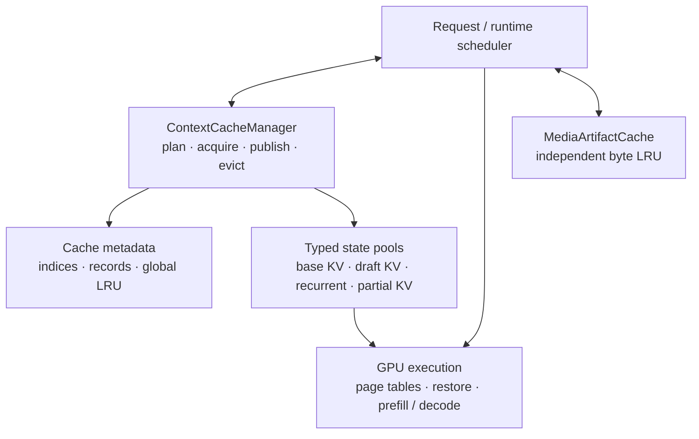
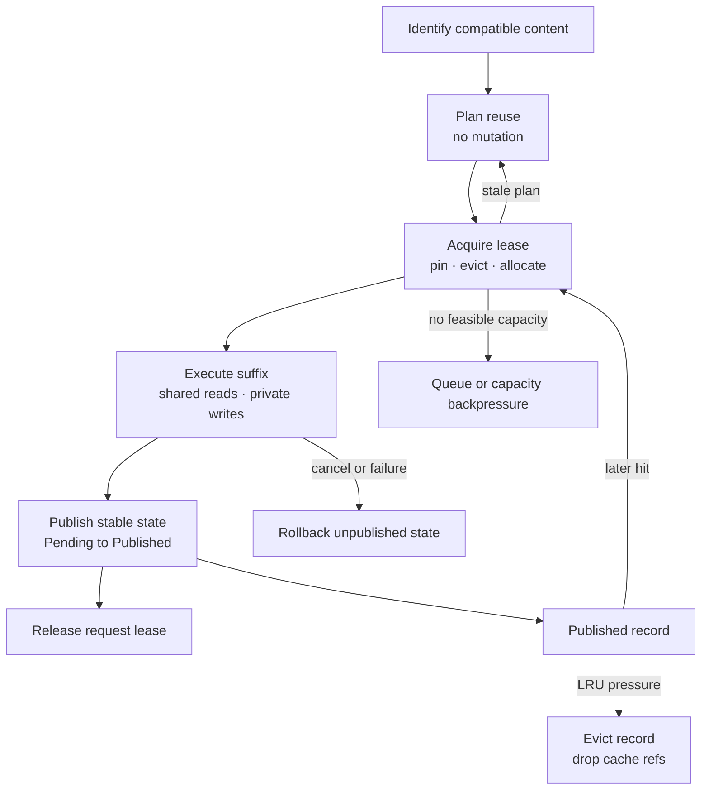
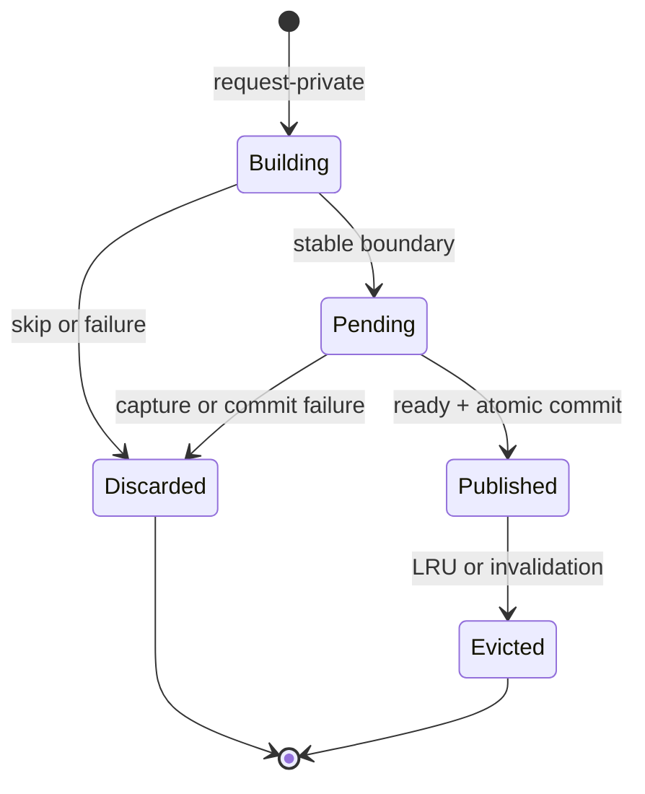

<!--
SPDX-FileCopyrightText: Copyright (c) 2025-2026 NVIDIA CORPORATION & AFFILIATES. All rights reserved.
SPDX-License-Identifier: Apache-2.0

Licensed under the Apache License, Version 2.0 (the "License");
you may not use this file except in compliance with the License.
You may obtain a copy of the License at

http://www.apache.org/licenses/LICENSE-2.0

Unless required by applicable law or agreed to in writing, software
distributed under the License is distributed on an "AS IS" BASIS,
WITHOUT WARRANTIES OR CONDITIONS OF ANY KIND, either express or implied.
See the License for the specific language governing permissions and
limitations under the License.
-->

# Production Context Cache Architecture and V1 Design

| Field | Value |
|---|---|
| Status | Normative implementation baseline |
| Date | 2026-07-06 |
| Integration destination | Formal integration into `main` |
| Scope | Single-device TensorRT Edge-LLM runtime |

[TOC]

## 1. Overview and scope

### 1.1 Problem and design thesis

Multi-turn and branched requests repeatedly evaluate histories whose model
state may already be resident on the device. The redundant work increases time
to first token and may also repeat image, video, or audio encoding.

The context cache is a **process-local, content-addressed store of immutable
model-execution checkpoints**. A request leases compatible state, computes its
uncached suffix in private storage, and may atomically publish new stable state
for later requests. Published records outlive requests and are evicted as
logical ownership units under memory pressure.

This is not a conversation database. Correctness comes from token, model,
adapter, position, media, and schema identity rather than a session id. A
future session API may provide history storage or lookup hints without
replacing content identity.

### 1.2 V1 decisions

| Area | Decision |
|---|---|
| Device | One runtime device; no distributed coordination |
| Storage | Startup-preallocated typed pools with on-demand page assignment |
| Ownership | Independent `activeRefCount` and `cacheRefCount` |
| Eviction | One global sequence-record LRU; separate media-artifact byte LRU |
| Planning | Side-effect-free `planVanilla()`, `planHybrid()`, or `planSpec()`, then transactional acquisition |
| Publication | Immutable, asynchronous preparation and atomic host visibility |
| Attention | Full pages only; full configured allocation for SWA |
| Hybrid | Exact atomic KV plus recurrent/convolution checkpoint |
| Speculative decode | Greedy non-hybrid EAGLE with joint base/draft matching |
| Multimodal | Media identity in sequence keys; encoder artifacts cached separately |
| Numerical behavior | Exact snapshot copies; model/precision accuracy tolerance end to end |

### 1.3 Supported matrix

| Model or state | Vanilla | Greedy EAGLE | Partial-tail behavior |
|---|---:|---:|---|
| Full attention | Yes | Yes | Reuse complete pages only |
| Sliding-window attention | Yes | Yes | Complete pages; allocate full KV length |
| Hybrid attention plus recurrent | Yes | No | Exact atomic checkpoint |
| Pure recurrent or linear attention | Yes | No | Exact checkpoint; base path may be empty |
| Image, video, or audio input | Yes | If base deployment supports it | Follows base model |
| Full-prefix hidden-state consumer | Full prefill | No sequence-state acceleration | Media-artifact reuse remains available |
| MTP or DFlash | No | No | Follow-up work |

The cache does not create model combinations that the no-reuse runtime cannot
already execute.

### 1.4 Goals and non-goals

V1 must:

- reuse prompt and committed generated-token state without a session id
- support branching histories and independent branch eviction
- manage base KV, draft KV, recurrent state, and partial KV coherently
- coexist across base-model and LoRA adapter generations
- key text, image, video, and audio input safely
- guarantee resources for every admitted active request
- expose hits, replay, publication, pressure, and eviction through metrics

V1 does not include:

- persistence, host swap, active preemption, or multi-device coordination
- pure-attention partial-page reuse or SWA window-aware reclamation
- hybrid EAGLE, MTP reuse, DFlash reuse, or non-greedy EAGLE
- cached logits, sampler/RNG state, or base-hidden bridge
- identical-checkpoint continuation without a new token to prefill
- tree-aware ownership, subtree eviction, or media patch/frame/chunk reuse

### 1.5 Architectural invariants

1. Published state is a pure function of all state-producing key material.
2. Published pages and snapshots are immutable; overlap uses private or COW
   storage.
3. Lookup and planning do not mutate ownership, LRU, allocation, or page tables.
4. Acquisition either returns one complete lease or leaves no lasting mutation.
5. A checkpoint becomes visible only when every required resource is ready and
   cache-owned.
6. A physical resource is free only when both active and cache refs are zero.
7. Misses and unsupported modes use an explicit semantically valid path; they
   never consume incomplete state.

## 2. Conceptual model and architecture

### 2.1 Terms

| Term | Meaning |
|---|---|
| Logical length | Complete token history known by the request |
| Resident length | Tokens represented by one named model state; EAGLE base and draft lengths may temporarily differ |
| Published length | Resident prefix visible to later requests |
| Full block | One immutable `pageSize`-token block eligible for block lookup |
| Partial tail | `residentLength % pageSize` tokens in a writable page |
| Compatibility identity | Digest of every input that can change stored model state |
| Reuse plan | Pure description of reusable state, replay, bindings, and new demand |
| Request lease | Active pins and private allocations owned by one logical request |
| Cache record | Published ownership and eviction unit containing a complete resource path |

### 2.2 Component organization



The manager owns host policy and metadata, not model computation. The runtime
uses the returned lease and bindings to update page tables, restore state, and
launch GPU work. Kernels do not make identity, ownership, or eviction
decisions.

| Component | Responsibility |
|---|---|
| Identity and indices | Map compatible logical prefixes to ready published state |
| Reuse planner | Choose executable reuse, replay/COW, and typed demand without mutation |
| Context cache manager | Revalidate, pin, allocate, publish, and evict transactionally |
| Cache record store | Own complete records, exact-record lookup, and global LRU |
| Typed pools | Own physical slots, dual refs, and free lists |
| Runtime and GPU paths | Bind/restore state and execute prefill, decode, and commit |
| Media artifact cache | Retain independently useful encoder outputs under a byte cap |

### 2.3 Two cache planes

```text
MediaArtifactCache:
    media content -> encoder output and auxiliary metadata

SequenceStateCache:
    expanded token/media prefix -> base/draft/recurrent model state
```

The planes share identity but not ownership. Sequence KV remains valid after a
media artifact is evicted because it already contains the effect of the media
embedding. An artifact can remain useful across unrelated prompts after every
sequence record that used it has been evicted.

## 3. Request and record lifecycle

### 3.1 Common request lifecycle



| Phase | State transition |
|---|---|
| Identify | Build domain, block chain, exact-prefix digests, and media descriptors |
| Plan | Convert index candidates and backend capability into one `ReusePlan` |
| Acquire | Revalidate, pin hits, evict if required, allocate all typed demand, and return a lease |
| Execute | Bind shared immutable state; write only private or COW resources |
| Publish | Prepare snapshots asynchronously, then install ownership and indices atomically |
| Release | Drop remaining active ownership on success, cancellation, or failure |

`ContextCacheManager::planVanilla()` handles ordinary autoregressive reuse.
`ContextCacheManager::planHybrid()` handles an exact atomic recurrent/attention
checkpoint.
`ContextCacheManager::planSpec()` is the speculative entry point; its initial
implementation accepts `SpecDecodeMode::kEAGLE` and explicitly rejects MTP,
DFlash, and other speculative modes rather than silently applying EAGLE
semantics.

### 3.2 Ownership transitions

| Event | Active ownership | Cache ownership |
|---|---:|---:|
| Private allocation | `+1` | `0` |
| Cache hit | `+1` | unchanged |
| Successful publication | retained until lease release | `+1` before visibility |
| Request completion or failure | `-1` | unchanged |
| Record eviction | unchanged | `-1` |

When a resource loses its last cache ref, its lookup mapping is removed even if
an active request still owns it. The bytes remain valid for that request but
are not offered to new requests until republished.

### 3.3 Record lifecycle



`Pending` state remains actively pinned and is neither visible nor evictable.
Cache ownership and indices are installed before producer activity is released.

### 3.4 Stable publication and rollback

V1 considers publication at prefill end, at policy-enabled decode end, and at
an explicitly configured hybrid interval. Publication is best-effort: failure
to retain a record does not fail inference.

Publication freezes identity and resource lists, enqueues required snapshot or
COW copies, and records a ready event. After readiness, the host canonicalizes
duplicates, adds cache ownership, and installs the record and all indices as
one metadata transaction. Consumers never observe a partial base/draft or
KV/recurrent bundle. Host commit returns `PublishStatus::kPublished` for a new
record or draft-state upgrade, `kExistingRecord`, or `kSkippedByPolicy`.

Canonicalization preserves physical lineage. A private block may rebind to an
existing canonical page, but descendants already computed from that private
duplicate cannot be attached to the canonical chain. Publication stops at the
first such mismatch; only descendants computed after the runtime rebinds may
extend the chain. The same rule prevents an EAGLE draft path or hybrid
checkpoint from being spliced onto base pages its producer did not consume.

`CommitPolicy::kIncludingGeneratedTokens` permits decode-end publication.
`CommitPolicy::kPrefillStateOnly` suppresses it when the next rendered turn is
not a token-exact extension of the generated stream. The policy changes only
publication, not generation or active-state lifetime.

The move-only `CacheRequestLease` is the single cleanup mechanism. It follows
the logical request across batch-slot remapping and releases every unpublished
pin or allocation on any early return. An already published prefill record
survives a later decode failure; unaccepted speculative writes never publish.
Manager and lease access remains under the same externally serialized
single-writer contract, and no lease may outlive its manager.

## 4. Common cache mechanics

### 4.1 Identity and lookup

`CacheDomainId` digests state-producing configuration: model weights, layer and
state schema, KV layout and dtype, page size, position encoding, relevant
execution features, adapter identity, and isolation salt. Engine reload or
incompatible configuration creates a different domain. Decoding strategy is
not a domain dimension; vanilla and EAGLE share compatible base KV.

`DraftEngineSignature` separately digests every draft-specific input that can
change accepted draft KV: draft weights and engine build, KV schema/layout and
dtype, draft-side adapter state, and the EAGLE conditioning contract. It is
stable across requests and excludes sampling-only policy. Paths, object
addresses, and other process-incidental values are not valid signatures.

Attention lookup uses a 128-bit chained hash over complete token blocks:

```text
H[i] = hash(H[i-1], token block i, semantic extras)
```

The chained key shape follows vLLM's
[Automatic Prefix Caching](https://docs.vllm.ai/en/v0.14.1/design/prefix_caching/)
design: parent hash, block tokens, and semantic extras. This implementation
defines its own tagged, deterministic 128-bit FNV-1a identity. It does not reuse
`cpp/common/hashUtils.h`, whose `std::hash`-based `size_t` values are unordered
container bucket hashes backed by key equality; `BlockHash` is the content
identity itself and has no secondary token comparison.

Semantic extras include media identity and placement, non-implied position
data, adapter generation, isolation salt, and custom-embedding identity.
Sampler settings, output limit, stop strings, and response format are excluded
because they do not produce model state. V1 accepts the 128-bit collision
stance and does not retain full token equality data per block.

FNV-1a is deterministic and inexpensive, not cryptographic. Hash identity is
an accidental-collision contract; access-controlled isolation must not rely on
the hash resisting a malicious input.

LoRA uses `{adapterId, adapterGeneration}`. Adapter variants coexist; changing
weights advances the generation instead of clearing unrelated cache entries.

The lookup shape follows state dependency:

```text
BaseBlockIndex:
    (CacheDomainId, BlockHash) -> basePageId

DraftPathIndex:
    (DraftEngineSignature, CacheDomainId, terminalBlockHash)
        -> set<{CacheRecordId, pathBlockCount}>

HybridCheckpointIndex:
    HybridCheckpointKey -> CacheRecordId
```

Base KV is canonicalized independently by complete logical block. Draft KV
is selected as one coherent record path because the last draft position in a
page depends on the first token of the next page. Hybrid state is indexed by an
exact token boundary because recurrent state at `L` cannot be reconstructed
from another length. Pure-attention lookup therefore needs no endpoint key.

Lookup has no recency or refcount side effects. If two requests publish the
same identity, first committer wins; the duplicate private state is released
and the existing record becomes MRU.

### 4.2 Planning and acquisition

A `ReusePlan` contains the executable reuse length, matched identities,
base/draft bindings, optional hybrid restore, COW sources, replay start, and
one typed `ResourceDemand`. It is advisory until acquisition revalidates it.

`ReusePlanKind` classifies valid plans:

- `kStandard`
- `kNoReusablePrefix`
- `kFullInputRewind`

Acquisition results are separate:

- `AcquireStatus::kAcquired`
- `AcquireStatus::kStalePlan`
- `AcquireStatus::kInsufficientCapacity`

Acquisition revalidates every referenced mapping, adds active refs before
eviction planning, finds a feasible victim set if necessary, allocates the
complete demand atomically, and returns one lease. Revalidation protects the
transaction boundary between side-effect-free planning and mutation; it is not
a substitute for thread synchronization. Stale or capacity failure returns no
lease and leaves no lasting mutation.

`LookupPolicy::kUseCache` performs normal matching. `kBypass` constructs an
explicit cold demand without consulting lookup indices, allowing a caller to
retry without accidentally consuming an incomplete or no-longer-affordable
hit. Cold acquisition may still evict retained records to make active demand
feasible; bypass disables lookup, not cache-capacity management.

Dynamic growth extends the same lease. Prefill allocates by chunk, vanilla
decode allocates before a boundary-crossing write, EAGLE acquires the complete
next proposal/verification demand, and hybrid restore acquires a writable
partial page before copying state.

### 4.3 Records and typed pools

```text
CacheRecord
  identity and logical block hashes
  complete base page path
  optional draft-engine signature
  optional coherent draft page path
  optional recurrent snapshot slot
  optional partial-KV snapshot slot
  optional exact checkpoint length
  LRU state
```

A record owns its complete path, not only its terminal page. This makes branch
eviction correct without parent/child metadata:

```text
record X owns A-B-C       record Y owns A-B-D
cacheRef(A,B)=2           cacheRef(C,D)=1
evict X -> A/B remain; C becomes reclaimable
```

V1 preallocates independent pools for base-KV pages, optional draft-KV pages,
recurrent snapshots, and hybrid partial-KV snapshots. Typed pools make layout,
alignment, and capacity proofs explicit. Media artifacts remain in a separate
variable-size byte-bounded cache.

Each typed resource ID directly names one physical page or snapshot slot in
its pool. A recurrent slot covers all recurrent/convolution layers at one exact
boundary; a partial-KV slot covers the partial attention page across all
attention layers.

### 4.4 Capacity and allocation

Dynamic assignment does not weaken the active-set guarantee:

```text
poolCapacity >= maximum simultaneous active footprint for that pool

maxBasePagesPerRequest = ceil(maxSequenceTokens / pageSize)
                           + peakBaseTransientPages
basePoolPages >= maxBatch * maxBasePagesPerRequest

maxDraftPagesPerRequest = ceil(maxDraftStateTokens / pageSize)
                          + peakDraftTransientPages
draftPoolPages >= maxConcurrentEagleRequests * maxDraftPagesPerRequest
```

Transient demand includes overlapping verification/proposal writes, backend
spill, EAGLE base/draft boundary COW, hybrid partial restore, and full-input
rewind. Live recurrent state and execution buffers are separately allocated
for `maxBatch`; immutable snapshot pools are cache-only and best-effort.

Startup validation also includes weights, TensorRT contexts/workspace, live
state, all pools, the media budget, and scratch in the device-memory total.
This aggregate check applies to discrete GPUs and Tegra shared memory.

Every allocation uses one all-or-nothing vector:

```text
ResourceDemand
  baseKvPages
  draftKvPages
  recurrentSnapshotSlots
  partialKvSnapshotSlots
```

Cache records may occupy all slack while requests are short. They are evicted
as active requests grow. A correctly configured admitted request must not fail
mid-generation because cached records consumed its future capacity. Admission
returns queueing or explicit backpressure when the complete active demand is
not feasible; new cache publication is simply skipped under pressure.

### 4.5 Global record LRU

Sequence-state eviction operates on records because base, draft, recurrent,
and partial state are valuable as coherent checkpoints. Physical pages are
still reclaimed at refcount granularity.

On shortage, the planner simulates records from LRU to MRU. It decrements
simulated cache refs and counts a resource only when simulated cache refs and
real active refs both reach zero. A victim may reclaim nothing by itself yet
be necessary before a later victim drops the last shared reference. Mutation
occurs only after every resource type in the demand is feasible. Free-capacity
requests bypass the LRU walk.

New publication, exact duplicate, base-only record upgrade to EAGLE, exact hybrid hit,
and coherent draft-path hit promote the relevant record. A base block hit
does not promote every record that happens to share the block.

A confirmed coherent draft hit is treated as the effective MRU during the
side-effect-free eviction simulation. The real LRU is touched only after
acquisition is feasible, so a failed acquisition still leaves no mutation.

`CacheRecordStore` intentionally uses flat records whose page paths are
vectors, not a radix tree. Complete-path cache refs already make branch
deletion correct; a tree would primarily improve prefix traversal and
leaf-first eviction policy, so it remains a later optimization.

### 4.6 Page-table and backend contract

Each base or draft attention layer uses a pool-shaped KV tensor and a shared
logical page table:

```text
layerKvPool: [2, numPages, pageSize, numKvHeads, headDim]
kernelPageTable: int32 [batch, 2, maxPagesPerSequence]
```

K and V occupy the two pool halves. The host stores logical K-page ids; the
kernel view carries K ids and pool-absolute V ids. Base and draft pools,
tables, and id spaces are independent.

The binding is required in every exported engine. Reuse-off binds an identity
table; reuse-on binds dynamic rows. V1 requires `pageSize == 128` for the
enabled paged backend set. `logicalMaxSequenceLength` controls model positions,
while page-aligned pool capacity controls addressing.

Every enabled prefill, decode, verification, commit, rollback, compaction, RoPE
write, and fallback path must honor non-identity page tables for reads and
writes. The host image is authoritative and submits dirty updates on the
execution stream. Plugins must not infer identity with a synchronizing D2H
probe or behave differently between debug and release.

## 5. Model-specific semantics

### 5.1 Attention-only and SWA

For vanilla attention, the planner uses the longest contiguous base-block
match:

```text
matchedTokens = matchedFullBlocks * pageSize
prefill = input[matchedTokens:]
```

V1 does not publish or match pure-attention partial pages. If an earlier turn
ends with three complete pages plus 17 tokens, the next turn reuses three pages
and prefills the 17-token old tail together with the new suffix into private
storage.

If a block-aligned match covers the complete input, the plan rewinds one full
page. A fresh generation request needs valid prefill output for first-token
logits, and near-zero prefill over a long reused prefix is an attention-kernel
edge case. The final page is recomputed privately and later canonicalized
against the existing page; published state is never overwritten.

SWA uses the same content chain and allocates the full configured logical KV
length in V1. The kernel applies the read window; physical window-aware
retention is deferred.

### 5.2 Hybrid and pure-recurrent models

At resident length `L`, a hybrid checkpoint atomically contains:

```text
all canonical full base pages before L
all recurrent and convolution state at exactly L
partial attention-KV snapshot when L % pageSize != 0
exact prefix identity and L
```

A pure-recurrent checkpoint has no base path or partial snapshot. Partial KV
without matching recurrent state, or recurrent state without matching KV, is a
complete miss.

```text
HybridCheckpointKey
  CacheDomainId
  exactPrefixDigest
  residentStateLength
  recurrentStateSchemaId
```

The record store reports ready candidate lengths below the request length.
Request hashing computes exact digests only at those boundaries and probes the
flat exact index from longest to shortest. Capture policy is not part of the
key: identical exact state has identical identity regardless of where it was
captured. On a hit, the runtime pins the whole record, binds
full pages, restores recurrent/convolution state into the live slot, COW-copies
an immutable partial snapshot into a writable page when present, and prefills
from `L`. It may choose an earlier complete checkpoint but never mix longer KV
with shorter recurrent state.

Capture is considered at prefill end and policy-enabled decode end. Periodic
capture is off by default and must satisfy:

```text
interval % pageSize == 0
interval % recurrentChunkQuantum == 0
```

Equivalently, it is a multiple of
`lcm(pageSize, recurrentChunkQuantum)`. Invalid values are rejected, not
rounded. Nonzero intervals require chunked prefill and capture only at chunk
ends; V1 does not launch a capture kernel per token.

Snapshot D2D copies restore byte-exact state. End-to-end bit identity is not an
API guarantee because chunking and kernel choice can change floating-point
reduction order.

### 5.3 EAGLE

V1 supports greedy EAGLE for full-attention and full-allocation SWA
deployments. Hybrid EAGLE is rejected; MTP and DFlash use no EAGLE cache path.
No logits, sampler/RNG state, or base-hidden bridge is retained.

The manager exposes this behavior through `planSpec()`, not an EAGLE-named
public planner. EAGLE is the only accepted speculative mode in the initial
host implementation; the generic entry-point name does not imply that MTP or
DFlash share these page-state semantics.

Base KV has identical semantics whether produced by vanilla execution or
EAGLE base verification:

```text
base-only record     -> usable by vanilla
base + draft record  -> usable by vanilla and EAGLE
```

There is no vanilla/EAGLE namespace. Vanilla ignores draft state. EAGLE uses
the longest prefix for which base and one coherent draft path both exist:

```text
baseBlocks = longest contiguous BaseBlockIndex prefix

pairedBlocks = largest n <= baseBlocks for which
               DraftPathIndex[draftSignature, domain, H[n-1]]
               returns one record path of at least n pages
```

Base-only blocks beyond the paired boundary remain useful to vanilla and are
ignored by EAGLE. A draft-path candidate always refers to a published record
that also owns a compatible base path. Multiple branches may register the
same terminal hash; lookup chooses one whole path and never stitches draft
pages from different records. Each EAGLE-capable record registers every full
block boundary in its committed path with the corresponding prefix length.
An endpoint record retains at most one `{draftSignature, draftPagePath}` pair,
matching the runtime's single loaded speculative strategy. Publishing the
same endpoint with a different draft signature atomically replaces only that
optional draft state; canonical base pages and their vanilla usefulness are
preserved.

Base verification and accepted-draft materialization have separate readiness
boundaries. `PublishRequest` therefore carries `baseResidentStateLength` and,
for EAGLE, `draftResidentStateLength`. Publication retains every complete ready
base page and pairs only

```text
floor(draftResidentStateLength / pageSize)
```

complete accepted draft pages. The paired draft boundary may lag the base
boundary without becoming partial-page reuse; base-only blocks beyond it remain
available to vanilla. This is required when generation ends after base
verification but before another draft accept step materializes the newly
accepted linear draft KV. The host must not label speculative tree/suffix bytes
as committed merely because their storage is allocated. A later publication
for the same endpoint and draft signature may extend the paired path in place;
only its newly added boundaries are registered.

#### Boundary replay

Draft KV position `i` depends on `hidden[i]` and `token[i+1]`. For a paired
match of `m` tokens, position `m-1` depends on the first token outside the
matched prefix. Because V1 does not cache the base hidden bridge, that base
hidden state and draft position must be recomputed.

When new tokens follow the paired prefix and both backends support mid-page
prefill, the plan rewinds one token:

```text
pairedTokens = pairedBlocks * pageSize
prefillStart = pairedTokens - 1
```

The manager allocates one private base page and one private draft page,
D2D-copies their final matched sources, and replaces the final binding in each
page table. The allocation and bindings are one transaction; base and draft
page ids remain independent.

If either backend cannot start mid-page, the plan rewinds one full paired page:

```text
effectiveReuseBlocks = max(0, pairedBlocks - 1)
prefillStart = effectiveReuseBlocks * pageSize
```

Dropping the final page binding does not remove its logical dependency. The
last slot in the retained draft prefix depends on the first token of the
replayed page. The plan therefore preserves the original coherent draft
boundary `{recordId, pairedBlocks, H[pairedBlocks - 1]}`. Acquisition revalidates
that boundary and publication compares its hash, while neither operation binds
or pins the dropped page.

When the paired match covers the complete input, the attention full-input rule
takes precedence: replay the final full page in private base and draft pages,
without an additional one-token rewind. A backend that cannot execute that
case performs full EAGLE prefill, never implicit vanilla decoding.

If no paired prefix exists, base KV cannot reconstruct historical draft KV
without the missing hidden states. The request performs full EAGLE prefill and
may atomically upgrade an existing base-only record with a draft path.
Non-greedy parameters may select vanilla before cache lookup; that is explicit
decoder selection, not an EAGLE miss fallback.

Only accepted committed base pages and a committed linear draft history are
published. Speculative tree/suffix pages never become indexed. Draft paths are
installed and removed with their record and are not independently
canonicalized by block hash.

### 5.4 Multimodal and audio input

One media item is identified by the complete producer contract:

```text
MediaArtifactKey
  modality
  canonical content digest
  input metadata digest
  preprocessing fingerprint
  encoder/projector fingerprint
  isolation domain
```

Image identity covers canonical decoded pixels, shape/layout, and color
semantics. Video additionally binds sampling and ordering/timestamps. Audio
hashes the canonical encoder input, including tensor bytes, shape, dtype,
sample-rate metadata, and preprocessing signature for precomputed features.
Paths and URLs are not content identity. LoRA participates when it changes the
media producer and always participates in sequence identity when it changes
the LLM.

An artifact contains the projected embedding plus any deepstack features,
span length, grid/chunk data, position/MRoPE metadata, and schema version. A
shape, dtype, hidden-size, or schema mismatch is a miss.

Multimodal runners separate:

```text
inspect(item) -> descriptor + prepared input
encode(missed prepared inputs) -> artifacts
assemble(required artifacts) -> LLM inputs
```

`inspect` may decode, hash, and derive span or grid metadata, but it must not
run the main media encoder; audio paths follow the same split.

If a media span lies fully inside the reused sequence prefix, no artifact is
needed for the request. Otherwise only missing items run through the encoder;
hits and new artifacts are assembled in original order. V1 preserves canonical
packed offsets even if reused prefix ranges leave unused holes.

The artifact cache owns GPU tensors under hard byte and entry caps. Hits are
pinned during assembly; new values serve the current request before
best-effort asynchronous publication. Duplicate keys are first-committer-wins.
Oversized or insertion-failed values are used but not retained.

A request requiring full-prefix per-token hidden states performs full base
prefill because KV reuse cannot recreate those outputs. Media-artifact reuse
remains enabled. The resulting sequence state may still be published for later
requests that do not require full-prefix hidden tensors.

## 6. Operational contract

### 6.1 Concurrency and readiness

One externally enforced single-writer path owns all index, record, refcount,
and LRU access that can overlap mutation. `ContextCacheManager` does not create
a metadata thread, own a task queue, or provide internal locking. The current
runtime must serialize the complete request/cache lifecycle; concurrent or
interleaved requests require a future queue/locking design plus readiness and
capacity rules for in-flight owners.

The host page-table image is authoritative. GPU copies and captures remain
asynchronous; a ready event moves state from `Pending` to an eligible host
commit. An index never points to unready state, and event failure discards only
the affected pending publication.

### 6.2 Error handling

| Condition | Behavior |
|---|---|
| Missing or stale base mapping | Remove or replan; treat as miss |
| Incomplete hybrid record | Remove the whole record; try an earlier checkpoint |
| Media schema mismatch | Remove artifact and encode normally |
| Snapshot or record pressure | Evict or skip publication |
| Unsupported mode/backend | Stable reason and explicit valid fallback |
| Unmapped write or violated capacity bound | Fail request and discard unpublished state |

Cache failures never clear unrelated LoRA/media domains or expose partially
written state.

### 6.3 Configuration

```text
ContextCacheConfig
  enabled = false
  baseKvPoolBytes or baseKvPoolPages
  optional draftKvPoolBytes or draftKvPoolPages
  maxSequenceTokensPerRequest
  maxBatchSize
  maxConcurrentEagleRequests = maxBatchSize
  recurrentSnapshotPoolBytes
  partialKvSnapshotPoolBytes
  maxCacheRecords
  mediaArtifactCacheBytes
  maxMediaArtifactEntries
  defaultCommitPolicy = IncludingGeneratedTokens

RequestCachePolicy
  disableReuse = false
  optional cacheSalt or isolationDomain
  optional commitPolicy
  optional recurrentCaptureIntervalTokens
```

Construction validates pool alignment, page size, engine sequence capacity,
active-set inequalities, capture support, and total device memory. A request
may disable lookup without clearing records. Cache enablement is independent
of speculative-decoding enablement. The explicit system-prompt cache becomes a
compatibility wrapper or is retired; system prompts are ordinary prefixes.

### 6.4 Numerical correctness

Stored KV, recurrent, convolution, and partial-snapshot copies must restore
byte-exact bytes. Different chunk sizes and kernels may change floating-point
reduction order, so V1 does not promise bit-identical end-to-end execution.

Paged kernels use dtype-appropriate tolerances. Deterministic greedy cases
require identical tokens away from decision ties. Reuse-on meets the same
per-model/per-precision accuracy threshold as reuse-off. EAGLE base
verification remains authoritative, while draft acceptance rate must also stay
within a workload-specific tolerance to detect invalid draft reuse.

### 6.5 Observability

| Area | Required signals |
|---|---|
| Reuse | Physical match, planned reuse, executed/published tokens, plan kind, miss reason |
| Model-specific | Hybrid checkpoint/fallback; EAGLE paired pages, replay mode, cold upgrade |
| Ownership | Active/cached/pending/free resources, records, skipped publication |
| Eviction | Victims, resources reclaimed, zero-reclaim intermediate records |
| Multimodal | Artifact hit/miss bytes, per-item encoder work, oversize/schema misses |
| Performance | Hash, plan, restore, capture, eviction time, TTFT, prefill GPU time |

Logs use stable reason codes rather than parsed free-form text.

## 7. Validation and rollout

Validation follows `export -> engine build -> inference`. Host-only tests prove
metadata algorithms but cannot establish model support.

| Layer | Required coverage |
|---|---|
| Host unit | Hash identity, dual refs, branches, pure plans, atomic allocation, eviction, unequal base/draft readiness, duplicate publication, commit policies |
| CUDA/kernel | Non-identity page tables, boundary/COW cases, recurrent restore, speculative commit/rollback, debug/release parity |
| End to end | Full/SWA/hybrid/recurrent, vanilla/EAGLE, text/media, LoRA, branching, pressure, failure, max batch |

End-to-end assertions must prove positive reuse as well as output correctness.
They cover vanilla consumption of EAGLE-produced base state, EAGLE one-token
and full-page replay, atomic hybrid misses, distinct media identity, hidden
consumer fallback, both commit policies, and zero leaked refs after failures.

Performance gates cover multi-turn TTFT, long-prefix planning overhead, hybrid
restore, EAGLE replay/acceptance, repeated-media encoder skip, disabled capture
overhead, and worst-case shortage-path LRU latency.

Capability may land in stages—paged ABI, host planning/lifecycle semantics
(including vanilla and EAGLE), runtime and CUDA wiring, hybrid, multimodal,
then production hardening—but every stage uses the final identity, lease,
publication, and ownership contracts. A disabled capability must not create a
second cache architecture.

## 8. Tradeoffs, follow-ups, and completion

### 8.1 Key tradeoffs

| Decision | Rationale |
|---|---|
| Content identity, not session identity | A session id cannot prove model, adapter, media, or token compatibility |
| Record LRU, not page LRU | Multi-resource checkpoints and branches need logical ownership |
| Complete paths, not a tree | More metadata, but direct V1 branch correctness and simpler lifecycle |
| Typed pools, not one allocator | Predictable alignment, layout, and active-capacity proof |
| Atomic hybrid checkpoint | Independently matched KV or recurrent state is unusable |
| EAGLE replay, not hidden bridge | Bounded recompute avoids another captured payload and lifecycle |
| Shared base KV across modes | Avoid duplicate base state without changing decoder strategy on miss |
| Independent media cache | Artifact and sequence state have different usefulness and lifetimes |

### 8.2 Follow-up work

- session handles as non-authoritative lookup hints
- tree ownership and leaf/subtree eviction policy
- pure-attention partial-page COW and SWA window-aware retention
- hybrid EAGLE, MTP reuse, and DFlash reuse
- hidden-state artifacts if a demonstrated product need justifies them
- variable-size media arena and patch/frame/chunk reuse
- active preemption, host swap, and multi-device coordination

### 8.3 Completion criteria

V1 is complete when:

1. The supported matrix passes export, engine build, and inference on required
   platforms.
2. Every enabled backend handles pool-shaped KV and non-identity page tables in
   debug and release.
3. Base, draft, recurrent, and partial resources are never visible or
   evicted incoherently.
4. Dynamic growth cannot fail for a validated admitted active set.
5. Branching and forced LRU pressure preserve correctness and leak no resource.
6. Media identities prevent false hits and artifact hits skip encoder work.
7. Unsupported combinations fail or fall back explicitly.
8. Both commit policies preserve generation behavior and cleanup.
9. Reuse meets existing accuracy gates and produces measurable latency benefit.
10. Every success, cancellation, and failure releases or transfers all active
    ownership.
