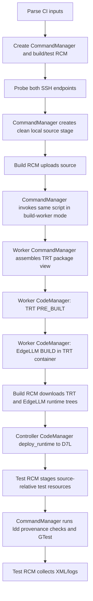

# TRT CI D7L Validation (Issue 451)

## Goal and scope

TensorRT CI needs one downstream check that proves a candidate TensorRT source
and build remain compatible with TensorRT Edge-LLM. A controller stages the
current Edge-LLM checkout on an SSH build host, cross-builds it for D7L, deploys
the candidate runtime to an independent D7L SSH target, and runs the C++ unit
tests there.

Success means:

- TensorRT is consumed only as a CodeManager `PRE_BUILT` artifact;
- Edge-LLM is built from source through CodeManager in a toolkit-managed TRT
  build container;
- all command execution uses CommandManager;
- all SSH transfer and remote filesystem work uses RemoteConnectionManager;
- runtime deployment uses `CodeManager.deploy_runtime()`; and
- the D7L unit-test exit code is returned to CI, with logs and GTest XML
  retained when available.

QNX/safety, model export, engine building, inference, accuracy testing, remote
tuning, and host provisioning are out of scope.

## Toolkit decision

This is an internal TRT CI entry point and requires TRT Dev Toolkit with Python
3.12 or newer. It deliberately contains no custom SSH/SCP/rsync runner and does
not call `subprocess`, `os.system`, Docker, or git-trt directly.

CodeManager's current remote source-build path validates container mount paths
on the controller and does not synchronize a remote Edge-LLM build back. To
avoid requiring identical controller/build-host filesystems, the same script
has a small internal worker mode. The controller stages the script with the
source and invokes the worker through CommandManager. The worker runs
CodeManager locally on the build host, where the TensorRT checkout, container
mounts, source, and build output are all visible.

The controller then relays the two runtime trees through
RemoteConnectionManager and asks a local CodeManager instance to deploy them
to D7L. This keeps the two SSH endpoints independent and avoids requiring the
build host to hold credentials for the board.

## Structure

Production code remains in `scripts/run_trt_ci_d7l.py`:

- `CiConfig` validates the CI interface and derives one safe `run-<id>` path.
- `ControllerServices` and `WorkerServices` expose only the toolkit facades
  each phase needs and are injectable in unit tests.
- `ControllerFlow` stages source, runs the build worker, retrieves runtime
  artifacts, deploys through CodeManager, runs GTest, and collects results.
- `BuildWorker` prepares the TensorRT package view and invokes CodeManager with
  the two build targets.
- small pure helpers construct remote configs, CodeManager targets, deployment
  results, and quoted shell fragments once; controller and worker do not
  duplicate those contracts.

No reusable library is introduced for this single CI caller.

## Flow



On success, remote run directories are removed unless `--keep-workspace` is
set. Failures preserve them for diagnosis. Result collection is best-effort
and never masks the primary build, deployment, or test status.

## Build contract

The supplied TensorRT paths are paths on the build host. Because CodeManager's
`PRE_BUILT` input must be one package root, the worker creates:

```text
<run>/trt-package/
  include/  <- <trt-root>/include, parser headers, generated NvInferVersion.h
  lib/      <- <trt-build-dir>/Release/lib, preserving SONAME symlinks
```

The CommandManager package-preparation command fails before CodeManager if the
required headers, `libnvinfer`, or `libnvonnxparser` are missing.

CodeManager receives exactly two targets on `Arch.D7L`:

1. TRT `PRE_BUILT`, `BuildMode.RELEASE`, whose `build_dir` is the package view
   and whose `repo_path` is the supplied TRT root.
2. Edge-LLM `BUILD`, `BuildMode.RELEASE`, whose repository and build paths are
   `<run>/source` and `<run>/build` and whose CMake additions are:

   ```text
   -DEMBEDDED_TARGET=auto-thor
   -DCMAKE_TOOLCHAIN_FILE=<run>/source/cmake/aarch64_linux_toolchain.cmake
   -DENABLE_CUTE_DSL=OFF
   ```

The Edge-LLM target intentionally leaves `trt_package_dir` unset. CodeManager
orders TRT first and injects the same-architecture TRT result. Its Edge-LLM
generator adds `TRT_PACKAGE_DIR`, CUDA, Release mode, and `BUILD_UNIT_TESTS=ON`,
then builds the default target set. The worker sets
`keep_containers_running=False`.

## Deployment and test contract

The controller downloads `<run>/trt-package` and `<run>/build` through the
build-host RCM. It creates a deployment-only CodeManager plan containing TRT
and Edge-LLM `PRE_BUILT` targets, reifies the steps as a successful `RunResult`
over those local paths without executing the plan, and calls:

```text
CodeManager.deploy_runtime(..., preferred_mode=DeploymentMode.RSYNC)
```

Toolkit fallbacks remain enabled. Deployment produces `<run>/trt`,
`<run>/edgellm`, and `setup_environment.sh` on D7L.

`unitTest` embeds its build-host source root. Therefore test RCM also stages
`unittests/resources` and, when present, `tests/chat_templates` at the same
absolute `<run>/source` path on D7L. CommandManager sources the generated
environment script, rejects unresolved dependencies, verifies that TensorRT
DSOs resolve below `<run>/trt`, and runs:

```text
<run>/edgellm/unitTest
  --gtest_filter=<filter>
  --gtest_output=xml:<run>/results/unit-tests.xml
```

The test command runs with a bounded toolkit timeout and its exact nonzero exit
code is returned when available (124 for a reported timeout, otherwise 1 when
the transport supplies no exit code).

## CLI contract

Required controller arguments:

- `--trt-root`, `--trt-build-dir` (build-host paths)
- `--build-host`, `--build-user`
- `--test-host`, `--test-user`

Optional arguments cover TRT branch, CUDA version, build/test ports, one jump
host per endpoint, strict known-host checking, workspace/run ID, artifact
directory, job count, GTest filter, phase timeouts, and workspace retention.

Toolkit SSH uses the caller's OpenSSH agent/config/default keys. The toolkit
does not expose an arbitrary identity-file option, so the script does not
reimplement one. Both the controller-to-build and controller-to-D7L credentials
must be pre-provisioned in TRT CI. Passwords and raw shell fragments are not
accepted.

The internal `--build-worker` interface is hidden and invoked only through the
controller's CommandManager with Python 3.12 and
`<trt-root>/scripts/devToolkit/src` on `PYTHONPATH`. Remote paths are quoted,
the workspace must be absolute and non-root, and cleanup is restricted to the
derived `run-<id>` child.

## Files and tests

```text
design/in_progress/trt_ci_d7l_validation.md   # architecture and test plan
scripts/run_trt_ci_d7l.py                     # controller + small build worker
scripts/README.md                              # internal CI usage
tests/python-unittests/test_run_trt_ci_d7l.py # behavior tests with toolkit fakes
```

The focused test suite does not require SSH, Docker, or D7L. It verifies:

1. remote configs map Linux/D7L targets, key auth, ports, jump hosts, and host
   key policy correctly;
2. target construction is exactly TRT `PRE_BUILT` followed by Edge-LLM source
   `BUILD`, with one shared D7L platform contract and no manual TRT binding;
3. the worker uses CommandManager for package preparation and CodeManager for
   the full build;
4. the controller's observable order is probe, stage, worker, retrieve,
   CodeManager deploy, resource stage, test, collect;
5. deployment artifacts are reconstructed from local RCM downloads without
   mutating or pretending to execute a second source build;
6. the test command sources the toolkit environment, checks candidate TRT
   provenance, applies the filter, and writes XML;
7. build/deployment failures stop later phases, test exits are preserved, and
   collection failures do not mask the primary result; and
8. production code contains no direct process or SSH implementation.

Validation:

```text
PYTHONPATH=<trt-root>/scripts/devToolkit/src:$PWD \
  python3.12 -m pytest tests/python-unittests/test_run_trt_ci_d7l.py -q
PYTHONPATH=<trt-root>/scripts/devToolkit/src \
  python3.12 -m py_compile scripts/run_trt_ci_d7l.py
pre-commit run --files scripts/run_trt_ci_d7l.py \
  tests/python-unittests/test_run_trt_ci_d7l.py scripts/README.md \
  design/in_progress/trt_ci_d7l_validation.md
```

The real two-host run remains an internal hardware/CI validation step.

## Residual constraints

- TRT Dev Toolkit and its Python dependencies must be available on the
  controller and build host.
- The build host needs the TRT container tooling and the normal D7L cross-build
  prerequisites; D7L needs `ldd` and a compatible CUDA runtime.
- The supplied TRT build uses the normal `Release/lib` layout.
- RemoteConnectionManager has no exclude list, so CommandManager creates a
  compact local source stage before upload.
- CodeManager's build timeout is not configurable. The controller bounds the
  worker with the remote `timeout` utility; a timed-out build may still require
  host-side cleanup if the SSH transport cannot terminate descendants.
