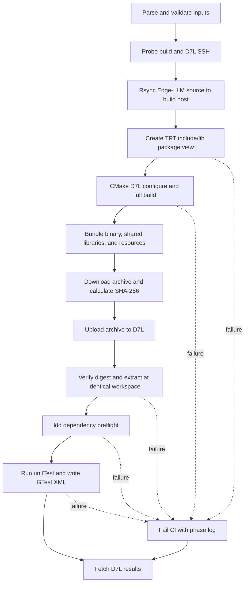

# TRT CI D7L Validation (Issue 451)

## Problem and scope

TensorRT CI needs a small downstream check that proves a candidate TensorRT
source/build remains compatible with TensorRT Edge-LLM. The check runs from an
Edge-LLM checkout, cross-builds the default Edge-LLM target set with C++
unit tests enabled on a Linux build host, deploys the resulting runtime bundle
to a D7L target, and runs the unit tests there.

Success means:

- the caller supplies the remote TensorRT source root and build directory;
- both build-host and D7L SSH endpoints are explicit and use non-interactive
  key/agent authentication;
- Edge-LLM configures for `auto-thor` with the AArch64 Linux toolchain and
  builds the default source targets, including `unitTest`, against the
  supplied TensorRT headers/libraries;
- the D7L run uses the candidate TensorRT libraries and returns the unit-test
  exit status to CI;
- local phase logs are retained, while D7L logs and GTest XML are collected
  best-effort without masking the primary result; and
- commands are deterministic, quoted, fail-fast, and small enough to maintain.

Out of scope: QNX or safety builds, remote tuning, model export, engine build,
model inference/accuracy, container lifecycle, password handling, board mount
repair, and persistent host provisioning.

## Tooling decision

The script is Python 3.8-compatible and standard-library-only. It mirrors TRT
Dev Toolkit practices (argv-based subprocesses, explicit SSH targets,
non-interactive probes, phase logs, and bounded timeouts) but does not import
the toolkit. Direct reuse would couple this compatibility check to the TRT
revision under test, require Python 3.12 plus NumPy/ONNX/PyYAML, and still would
not model the build-host-to-test-host handoff or an explicit target identity
file. This keeps failures attributable to TensorRT/Edge-LLM rather than the
orchestration environment.

## Structure and responsibilities

All production code stays in one focused script:

- `SshTarget` (immutable dataclass)
  - stores host, user, port, optional identity file/jump host, and host-key
    policy;
  - renders SSH, SCP, and rsync transport arguments without secrets.
- `CommandRunner`
  - runs argv lists, streams combined output to console and a phase log,
    enforces a real timeout, and raises a contextual error on failure.
- `TrtCiConfig` (immutable dataclass)
  - validates local paths separately from remote POSIX paths and derives one
    run-specific child below a safe workspace base, identically on both hosts.
- `TrtCiFlow`
  - probes endpoints;
  - rsyncs the current Edge-LLM checkout to the build host;
  - prepares a TensorRT package view from `<trt-root>/include` and shared
    libraries found below `<trt-build-dir>`;
  - cross-configures/builds the default Edge-LLM target breadth with unit
    tests enabled while intentionally leaving CuTe DSL disabled;
  - bundles `unitTest`, a parser-linked provenance executable, Edge-LLM shared
    objects, candidate TensorRT runtime libraries, and source-relative
    unit-test resources;
  - transfers the archive through a local temporary file, verifies its digest,
    deploys it at the same absolute workspace on D7L, runs `ldd` and GTest, and
    collects results best-effort in `finally` without masking the primary
    phase error or its exit code.
- `parse_args()` / `main()`
  - define the stable CI interface and map expected failures to a nonzero exit.

No reusable library module is introduced because there is only one caller and
the SSH/build stages share one small configuration object.

## Control flow



## Remote build contract

The build command uses:

```text
cmake -S <workspace>/source -B <workspace>/build
  -DCMAKE_BUILD_TYPE=Release
  -DBUILD_UNIT_TESTS=ON
  -DEMBEDDED_TARGET=auto-thor
  -DCMAKE_TOOLCHAIN_FILE=<workspace>/source/cmake/aarch64_linux_toolchain.cmake
  -DTRT_PACKAGE_DIR=<workspace>/trt-package
  -DCUDA_CTK_VERSION=<override-or-/usr/local/cuda/bin/nvcc-version>
  -DENABLE_CUTE_DSL=OFF
cmake --build <workspace>/build --parallel <jobs>
```

The package view archive-preserves `<trt-root>/include/.`, overlays the
required generated `<trt-build-dir>/include/NvInferVersion.h`, and then
archive-preserves `<trt-root>/parsers/onnx/.` under `include/`. It next
archive-preserves the complete
TensorRT library directory selected from `<trt-build-dir>/Release/lib` (with a
bounded fallback search). Selection prefers that exact Release path; fallback
candidates are sorted and exactly one complete directory is required. Relative
SONAME symlinks are preserved, while absolute, out-of-tree, or broken required
symlinks are rejected. This avoids misclassifying a newly introduced TensorRT
DSO dependency as an Edge-LLM regression. Configuration fails before
compilation if `NvInfer.h`, generated `NvInferVersion.h`,
`NvOnnxParser.h`, `libnvinfer`, or `libnvonnxparser` is absent.

The same absolute run-specific workspace is used on D7L because `unitTest`
embeds `PROJECT_ROOT_DIR` at compilation time. The deployment includes
`unittests/resources` (and `tests/chat_templates` when present), so
source-relative tests do not accidentally depend on the build host. Runtime
sets `LD_LIBRARY_PATH=<run>/trt-package/lib:<run>/build:${LD_LIBRARY_PATH:-}`
and rejects an `ldd` result where any `libnvinfer*` or `libnvonnxparser*`
resolves outside the deployed package; a board-installed TRT can never satisfy
the check silently.

## CLI contract

Required:

- `--trt-root`, `--trt-build-dir`
- `--build-host`, `--build-user`
- `--test-host`, `--test-user`

Optional, with conservative defaults:

- build/test SSH ports, a shared identity file, and per-endpoint jump hosts;
- `--workspace` (safe base only), `--run-id`, `--artifacts-dir`,
  `--cuda-version`, and `--jobs` (CUDA is detected from build-host
  `/usr/local/cuda/bin/nvcc --version` when no override is supplied);
- `--gtest-filter` (default `*`, matching the existing `test_unit_tests`
  behavior);
- connection/build/test/transfer timeouts and `--keep-workspace`.

The script intentionally does not accept passwords or raw shell fragments.
Remote TRT paths are validated over build-host SSH, never with local
`Path.exists()`. The workspace must be absolute and non-root; a restricted
`run-<id>` child is generated, validated, and is the only remotely deleted
path.

## Files

```text
design/in_progress/trt_ci_d7l_validation.md   # this design and test plan
scripts/run_trt_ci_d7l.py                     # CI entry point
scripts/README.md                              # invocation and prerequisites
tests/python-unittests/test_run_trt_ci_d7l.py # behavior-focused unit tests
```

The production entry point remains smaller than the D7Q safety reference while
retaining explicit transport, timeout, provenance, and cleanup behavior. The
larger behavior-focused test file exercises generated Bash and failure paths
without duplicating production helpers. Helpers are extracted only where they
remove repeated transport, quoting, or execution logic.

## Test design

Local tests do not require SSH hardware. They validate observable command and
configuration behavior with a recording runner:

1. SSH/SCP/rsync argv include user, port, identity, jump host, BatchMode, and
   selected host-key policy without embedding a password.
2. Build script contains the D7L toolchain, `auto-thor`, candidate TRT package
   view, detected/overridden CUDA version, unit-test flag, CuTe DSL opt-out, and
   the default full-source build rather than only `unitTest`.
3. Build inputs and all remote paths are shell-quoted, including spaces and
   metacharacters.
4. Build/package scripts require generated `NvInferVersion.h`, check all TRT
   artifacts, and stage unit-test resources plus the complete selected TRT
   runtime-library directory and safe symlinks.
5. D7L script verifies SHA-256, rejects missing `ldd` dependencies, preserves
   pipeline status, applies the GTest filter, and writes XML/log artifacts.
6. Flow ordering is probe -> sync -> build -> bundle -> transfer -> deploy ->
   test -> collect; collection failure never masks a primary error or exit code,
   including when deploy never created remote results.
7. CLI validation distinguishes local source/key/artifact paths from remote TRT
   paths and rejects unsafe workspace bases/run IDs, invalid ports/timeouts/jobs,
   and an unavailable submodule checkout with actionable messages.
8. `CommandRunner` terminates the full subprocess group on timeout; separate
   regressions prove that same-group children are stopped and that a detached child
   retaining stdout cannot block the controller beyond bounded cleanup.
9. Source-root resolution uses `Path(__file__).resolve()`, remains independent
   of caller CWD, and remote paths use `PurePosixPath`.

Validation commands:

```text
python -m pytest tests/python-unittests/test_run_trt_ci_d7l.py -q
python -m py_compile scripts/run_trt_ci_d7l.py
pre-commit run --files scripts/run_trt_ci_d7l.py \
  tests/python-unittests/test_run_trt_ci_d7l.py \
  scripts/README.md design/in_progress/trt_ci_d7l_validation.md
```

The real two-host run is hardware-dependent and remains a CI/manual validation
step; this change does not claim to execute it locally.

## Performance and maintenance notes

- The default Edge-LLM build catches compile-time TRT API drift across the
  builder, plugin, examples, and unit tests. Model data and unrelated TRT build
  outputs are not copied; only the selected runtime `lib` directory is staged.
- Rsync excludes VCS metadata, worktrees, local builds, caches, logs, and
  generated artifacts.
- Transfers are archive-based between the two independent SSH endpoints, so no
  build-host trust of the board or shared filesystem is assumed.
- Every expensive phase has a configurable timeout and a distinct log.
- Only the validated run-specific child is cleaned before use. Successful
  runs remove that child unless `--keep-workspace`; failed runs preserve it for
  debugging.

## Assumptions and residual risks

- The controller has `ssh`, `scp`, and `rsync`; the build host has CMake, the
  AArch64 compiler, a compatible CUDA toolkit, `find`, and `tar`; D7L has CUDA
  and `ldd`.
- The supplied TRT source/build paths exist on the build host, not necessarily
  on the controller or D7L.
- Edge-LLM submodules are initialized before source sync.
- Key/agent-based SSH is pre-provisioned. A jump endpoint, when supplied, is in
  OpenSSH `user@host[:port]` form.
- A malformed TRT build tree with multiple complete `Release/lib` candidates
  is rejected rather than silently selecting an arbitrary one.
