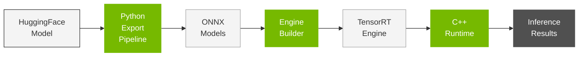

# Getting Started

> **Repository:** [github.com/NVIDIA/TensorRT-Edge-LLM](https://github.com/NVIDIA/TensorRT-Edge-LLM)

## Table of Contents

- [Overview](#overview)
- [Supported Platforms](#supported-platforms)
- [Quick Start (15 min)](#quick-start-guide)
- [Installation](#installation)

---

## Overview

### What is TensorRT Edge-LLM?

TensorRT Edge-LLM is NVIDIA's high-performance C++ inference runtime for Large Language Models (LLMs) and Vision-Language Models (VLMs) on embedded platforms. It enables efficient deployment of state-of-the-art language models on resource-constrained devices like NVIDIA Jetson and DRIVE platforms.

### Key Features

- **🚀 High Performance**: Optimized CUDA kernels and TensorRT integration for maximum throughput
- **💾 Memory Efficient**: Advanced KV cache management and quantization support (FP8, INT4)
- **🔄 Production Ready**: C++-only runtime with no Python dependencies
- **🎯 Edge Optimized**: Designed specifically for embedded and automotive platforms
- **🔧 Flexible**: Support for LoRA adapters, speculative decoding, and multimodal models
- **📊 Complete Toolkit**: Python export pipeline, engine builder, and runtime in one package

### System Architecture

TensorRT Edge-LLM consists of three major components:



1. **Python Export Pipeline**: Converts PyTorch/HuggingFace models to ONNX format with optional quantization
2. **Engine Builder**: Compiles ONNX models into optimized TensorRT engines
3. **C++ Runtime**: Executes inference efficiently with KV cache management and sampling

### Use Cases

TensorRT Edge-LLM is ideal for:

**🚗 Automotive**
- In-vehicle AI assistants
- Voice-controlled interfaces
- Scene understanding and description
- Driver assistance systems

**🤖 Robotics**
- Natural language interaction
- Task planning and reasoning
- Visual question answering
- Human-robot collaboration

**🏭 Industrial IoT**
- Equipment monitoring with NLP
- Automated inspection with vision
- Predictive maintenance descriptions
- Voice-controlled machinery

**📱 Edge Devices**
- On-device chatbots
- Offline language processing
- Privacy-preserving AI
- Low-latency inference

---

## Supported Platforms

### Hardware Platforms

#### NVIDIA Jetson Thor Platform

<table style="border-collapse: collapse; width: auto; border: 1px solid #e0e0e0;">
<tr>
<th style="border: 1px solid #e0e0e0; padding: 10px; font-weight: bold; background-color: #f4f4f4;">Platform</th>
<th style="border: 1px solid #e0e0e0; padding: 10px; font-weight: bold; background-color: #f4f4f4;">GPU Architecture</th>
<th style="border: 1px solid #e0e0e0; padding: 10px; font-weight: bold; background-color: #f4f4f4;">Typical Models</th>
</tr>
<tr>
<td style="border: 1px solid #e0e0e0; padding: 10px;"><strong>Jetson Thor</strong></td>
<td style="border: 1px solid #e0e0e0; padding: 10px;">NVIDIA Blackwell GPU<br>Full precision support</td>
<td style="border: 1px solid #e0e0e0; padding: 10px;">Llama 3 (8B)<br>Qwen 2/2.5/3 (0.5B-7B)<br>DeepSeek-R1 (1.5B-7B)<br>Qwen2/2.5-VL (2-7B)<br>InternVL3 (1-2B)</td>
</tr>
</table>

#### NVIDIA DRIVE Thor Platform

<table style="border-collapse: collapse; width: auto; border: 1px solid #e0e0e0;">
<tr>
<th style="border: 1px solid #e0e0e0; padding: 10px; font-weight: bold; background-color: #f4f4f4;">Platform</th>
<th style="border: 1px solid #e0e0e0; padding: 10px; font-weight: bold; background-color: #f4f4f4;">Target Application</th>
<th style="border: 1px solid #e0e0e0; padding: 10px; font-weight: bold; background-color: #f4f4f4;">Use Cases</th>
</tr>
<tr>
<td style="border: 1px solid #e0e0e0; padding: 10px;"><strong>DRIVE Thor</strong></td>
<td style="border: 1px solid #e0e0e0; padding: 10px;">Automotive AI & Autonomous Driving</td>
<td style="border: 1px solid #e0e0e0; padding: 10px;">In-vehicle assistant<br>Voice control<br>Scene understanding<br>ADAS integration<br>Autonomous driving perception</td>
</tr>
</table>

> **Note:** The platforms listed above are officially supported and tested. While TensorRT Edge-LLM may run on other NVIDIA GPU platforms (e.g., discrete GPUs, other Jetson devices), these are not officially supported. Users are free to experiment with other platforms at their own risk.

### Software Requirements

**Operating Systems:**
- **JetPack 7.1** (for Jetson Thor)
- **DRIVE OS** (for DRIVE Thor)

**C++ Runtime Dependencies:**
- CUDA 13.x (included in JetPack 7.1 / DRIVE OS)
- TensorRT 10.x+ (included in JetPack 7.1 / DRIVE OS)
- C++17 compiler (GCC 11+)

**Python Dependencies** (for export pipeline - run on x86 host):
- Python 3.8+
- PyTorch 2.8.0
- Transformers 4.55.2
- NVIDIA ModelOpt 0.35.0
- ONNX 1.18.0
- Datasets 4.0.0
- NumPy 2.3.0
- tqdm 4.67.1

### Supported Model Families

**Large Language Models:**
- Llama 3.x (3B, 8B)
- Qwen 2/2.5/3 (0.5B - 7B)
- DeepSeek-R1 Distilled (1.5B, 7B)

**Vision-Language Models:**
- Qwen2/2.5-VL (2B, 3B, 7B)
- InternVL3 (1B, 2B)

See [Supported Models](02_Supported_Models.md) for complete list.

---

## Quick Start Guide

This quick start guide will get you up and running with TensorRT Edge-LLM in ~15 minutes.

### Prerequisites

- NVIDIA Jetson Thor or DRIVE Thor
- JetPack 7.1 or DRIVE OS installed
- Internet connection for downloading models
- x86 Linux host with GPU for model export

### Step 1: Clone Repository

```bash
git clone https://github.com/NVIDIA/TensorRT-Edge-LLM.git
cd TensorRT-Edge-LLM
```

### Step 2: Install Python Package (on x86 host)

```bash
# Install Python package with all dependencies
pip3 install .
```

This installs the Python export tools and all required dependencies.

### Step 3: Build C++ Project (on device)

```bash
# Install system build tools if needed
sudo apt update
sudo apt install cmake build-essential

# Build the project
mkdir build
cd build
cmake .. \
    -DTRT_PACKAGE_DIR=/path/to/TensorRT \
    -DCMAKE_TOOLCHAIN_FILE=cmake/aarch64_linux_toolchain.cmake \
    -DEMBEDDED_TARGET=jetson-thor
make -j$(nproc)
```

**Note**: Both the toolchain file and embedded target are required for all Edge device builds.

This will build:
- C++ engine builder applications
- C++ runtime and examples

### Step 4: Download and Export a Model (on x86 host)

Let's use [Qwen3-0.6B](https://huggingface.co/Qwen/Qwen3-0.6B) as a lightweight example:

```bash
# Quantize to FP8 (downloads model automatically)
tensorrt-edgellm-quantize-llm \
    --model_dir Qwen/Qwen3-0.6B \
    --output_dir ./quantized/qwen3-0.6b \
    --quantization fp8

# Export to ONNX
tensorrt-edgellm-export-llm \
    --model_dir ./quantized/qwen3-0.6b \
    --output_dir ./onnx/qwen3-0.6b
```

### Step 5: Build TensorRT Engine (on Thor device)

Transfer the ONNX files to your Thor device, then:

```bash
./build/examples/llm/llm_build \
    --onnxDir ./onnx/qwen3-0.6b \
    --engineDir ./engines/qwen3-0.6b \
    --maxBatchSize 1
```

Build time: ~5-15 minutes

### Step 6: Run Inference

Create an input file `input.json` with your prompts:

```json
{
    "batch_size": 1,
    "temperature": 1.0,
    "top_p": 1.0,
    "top_k": 50,
    "max_generate_length": 128,
    "default_system_prompt": "You are a helpful assistant.",
    "messages": [
        {
            "user": "Hello. What is the capital of the United States?",
            "system": "You are a helpful assistant.",
        }
    ]
}
```

Then run inference:

```bash
./build/examples/llm/llm_inference \
    --engineDir ./engines/qwen3-0.6b \
    --inputFile input.json \
    --outputFile output.json
```

**Input File Format:**
- `batch_size`: Number of concurrent requests (usually 1)
- `temperature`: Sampling temperature (higher = more random)
- `top_p`: Nucleus sampling threshold
- `top_k`: Top-K sampling limit
- `max_generate_length`: Maximum tokens to generate
- `default_system_prompt`: Default system instruction
- `messages`: Array of user prompts with optional system prompts
- `reference`: Optional expected output (for testing/validation)

**Note:** Example input files are available in [`tests/test_cases/`](../../tests/test_cases/) (e.g., `llm_basic.json`).

**Success!** 🎉 Check `output.json` for model responses.

### Next Steps

- Try other models: [Supported Models](02_Supported_Models.md)
- Explore examples: [`examples/`](../../examples/)
- Learn components: [Key Components](03_Key_Components.md)

---

## Installation

TensorRT Edge-LLM has two separate components that need to be installed on different systems:

1. **Python Export Pipeline** (runs on x86 host with GPU)
2. **C++ Runtime** (builds and runs on Edge devices)

---

### Part 1: Python Export Pipeline (x86 Host with GPU)

The Python export pipeline converts and quantizes models. This must run on an x86 Linux system with an NVIDIA GPU.

#### System Requirements

- **Platform**: x86-64 Linux system
- **GPU**: NVIDIA GPU (for model quantization)
- **CUDA**: 12.x or 13.x
- **Python**: 3.8+

#### Installation Steps

**1. Clone Repository**

```bash
git clone https://github.com/NVIDIA/TensorRT-Edge-LLM.git
cd TensorRT-Edge-LLM
```

**2. Install Python Package**

```bash
# Create virtual environment (recommended)
python3 -m venv venv
source venv/bin/activate

# Install package with all dependencies
pip3 install .
```

This installs:
- PyTorch 2.8.0
- Transformers 4.55.2
- NVIDIA ModelOpt 0.35.0
- ONNX 1.18.0
- All other required dependencies

**3. Verify Installation**

```bash
# Test export tools
tensorrt-edgellm-export-llm --help
tensorrt-edgellm-quantize-llm --help
```

**You're done with export pipeline setup!** You can now export and quantize models. The ONNX files will be transferred to the Edge device for runtime deployment.

---

### Part 2: C++ Runtime (Edge Device)

The C++ runtime builds and executes models on the target Edge device. This must be built on or for the target platform.

#### System Requirements

**Target Platform:**
- NVIDIA Jetson Thor or DRIVE Thor
- JetPack 7.1 or DRIVE OS
- CUDA 13.x (included in JetPack/DRIVE OS)
- TensorRT 10.x+ (included in JetPack/DRIVE OS)

#### Build Instructions

**1. Install System Dependencies (on Edge device)**

```bash
sudo apt update
sudo apt install -y \
    cmake \
    build-essential \
    git
```

**2. Verify CUDA and TensorRT Installation**

```bash
# Check CUDA version
nvcc --version  # Should show CUDA 13.x

# Check TensorRT version
dpkg -l | grep tensorrt  # Should show TensorRT 10.x+
```

If not installed:
```bash
# For JetPack 7.1
sudo apt install nvidia-jetpack
```

**3. Clone Repository (on Edge device)**

```bash
git clone https://github.com/NVIDIA/TensorRT-Edge-LLM.git
cd TensorRT-Edge-LLM
```

**4. Configure Build**

```bash
mkdir build
cd build

# For Edge devices (Thor, Jetson, etc.) - Requires toolchain + embedded target
cmake .. \
    -DCMAKE_BUILD_TYPE=Release \
    -DTRT_PACKAGE_DIR=/path/to/TensorRT \
    -DCMAKE_TOOLCHAIN_FILE=cmake/aarch64_linux_toolchain.cmake \
    -DEMBEDDED_TARGET=jetson-thor

# For GPUs (SM80, 86, 89, 120) - No toolchain or embedded target needed
cmake .. \
    -DCMAKE_BUILD_TYPE=Release \
    -DTRT_PACKAGE_DIR=/path/to/TensorRT \
    -DCUDA_VERSION=13.0
```

**CMake Options:**

| Option | Description | Default |
|:-------|:------------|:--------|
| `TRT_PACKAGE_DIR` | Path to TensorRT installation | Required |
| `CMAKE_TOOLCHAIN_FILE` | **Required for Edge devices**: Use `cmake/aarch64_linux_toolchain.cmake` for Edge device builds. **Not needed for GPU builds** (SM80, 86, 89, 120) | N/A |
| `EMBEDDED_TARGET` | **Required for Edge devices**: Target platform (`jetson-thor`). **Not needed for GPU builds** | N/A |
| `CUDA_VERSION` | CUDA version (e.g., 13.0). Important for matching target platform. | 12.8 |
| `BUILD_UNIT_TESTS` | Build unit tests | OFF |

**Supported GPU Compute Capabilities:**
- **SM80**: Ampere (e.g. A100, A30, A10)
- **SM86**: Ampere (e.g. RTX 30 series, RTX Pro Ampere series)
- **SM89**: Ada Lovelace (e.g. RTX 40 series, L4, L40, RTX Pro Ada series)
- **SM120**: Blackwell (e.g. RTX 50 series, RTX Pro Blackwell series)

**5. Build Project**

```bash
make -j$(nproc)
```

Build time: ~1-2 minutes depending on hardware.

**6. Verify Build**

```bash
# Test C++ examples
./examples/llm/llm_build --help
./examples/llm/llm_inference --help
```

**You're done with C++ runtime setup!** You can now build engines and run inference on the Edge device.

---

### Complete Workflow Summary

**On x86 Host (Export Pipeline):**
1. Install Python package
2. Export and quantize models
3. Transfer ONNX files to Edge device

**On Edge Device (C++ Runtime):**
1. Build C++ runtime
2. Build TensorRT engines from ONNX files
3. Run inference

See the [Quick Start Guide](#quick-start-guide) for a complete end-to-end example.

---

### Troubleshooting

#### Python Export Pipeline Issues (x86 Host)

**Issue: Python package import errors**

Solution: Ensure virtual environment is activated and package is installed:
```bash
source venv/bin/activate
pip3 install .
```

**Issue: Out of memory during quantization**

Solution: Use smaller calibration dataset or run on CPU:
```bash
tensorrt-edgellm-quantize-llm \
    --model_dir model_name \
    --quantization fp8 \
    --calib_size 128  # Reduce from default
```

**Issue: CUDA out of memory during export**

Solution: Export on a system with more GPU memory or use a smaller model for testing.

#### C++ Runtime Issues (Edge Device)

**Issue: `nvcc: command not found`**

Solution: Ensure JetPack 7.1 or DRIVE OS is properly installed with CUDA support:
```bash
# Verify CUDA installation
nvcc --version
# Should show CUDA 13.x
```

**Issue: `TensorRT not found` during CMake**

Solution: Specify TensorRT package directory:
```bash
cmake .. \
    -DTRT_PACKAGE_DIR=/usr/local/TensorRT-10.x.x \
    -DCMAKE_TOOLCHAIN_FILE=cmake/aarch64_linux_toolchain.cmake \
    -DEMBEDDED_TARGET=jetson-thor
```

**Issue: Out of memory during C++ build**

Solution: Reduce parallel jobs:
```bash
make -j2  # Instead of make -j$(nproc)
```

**Issue: `cudaMallocAsync` fails with large memory allocation**

Solution: Increase huge pages (up to DriveOS 7.0.3.0):
```bash
echo 24576 | sudo tee /proc/sys/vm/nr_hugepages
```

#### Getting Help

- **Documentation**: Check the [docs/](.) directory
- **Issues**: Report bugs on [GitHub Issues](https://github.com/NVIDIA/TensorRT-Edge-LLM/issues)
- **Discussions**: Ask questions on [GitHub Discussions](https://github.com/NVIDIA/TensorRT-Edge-LLM/discussions)
- **Community**: Join the NVIDIA Developer Forums

### Uninstallation

**Python Export Pipeline (x86 Host):**
```bash
# Deactivate and remove virtual environment
deactivate
rm -rf venv

# Remove repository (optional)
rm -rf TensorRT-Edge-LLM
```

**C++ Runtime (Edge Device):**
```bash
# Remove build directory
cd TensorRT-Edge-LLM
rm -rf build

# Remove repository (optional)
cd ..
rm -rf TensorRT-Edge-LLM
```

---

## Next Steps

Now that you have TensorRT Edge-LLM installed, continue to:

1. **[Models](02_Models.md)**: Learn about supported models and how to prepare them
2. **[Key Components](03_Key_Components.md)**: Understand the system architecture
3. **[Examples](04_Examples.md)**: Explore example applications and use cases

---

**For questions or issues, please visit our [GitHub repository](https://github.com/NVIDIA/TensorRT-Edge-LLM).**


