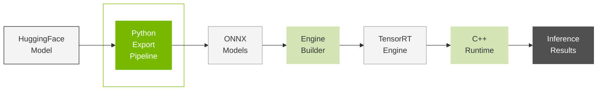

# Python Export Pipeline

**Part of**: [Key Components Series](03_Key_Components.md)  
**Next**: [Engine Builder](03.2_Engine_Builder.md)

---

## Table of Contents

- [Overview](#overview)
- [Export Pipeline Workflow](#export-pipeline-workflow)
- [Export Tool Overview](#export-tool-overview)
- [Available Export Tools](#available-export-tools)
- [Quantization Methods](#quantization-methods)
- [Usage Examples](#usage-examples)
- [Best Practices](#best-practices)

---

## Overview

The TensorRT Edge-LLM Export Pipeline is a comprehensive Python-based system that transforms HuggingFace models into optimized ONNX representations suitable for TensorRT engine compilation. The pipeline handles model quantization, ONNX export, and specialized features like LoRA adaptation and multimodal processing.

### Purpose

The export pipeline serves as the **first stage** in the TensorRT Edge-LLM workflow:



**Key Responsibilities**:
- Load models from HuggingFace Hub or local storage
- Apply quantization (FP8, INT4 AWQ, NVFP4)
- Export to ONNX format with TensorRT optimizations
- Handle special model types (EAGLE, VLM, LoRA)
- Generate configuration files for engine building

---

## Export Pipeline Workflow

The export pipeline follows a multi-stage process to transform models:

### Pipeline Stages

1. **Model Loading**: Load HuggingFace model and tokenizer
2. **Quantization** (Optional): Apply precision reduction techniques
3. **ONNX Export**: Convert PyTorch model to ONNX format
4. **Graph Surgery**: Optimize ONNX graph for TensorRT
5. **Configuration Generation**: Create build configuration files

---

## Export Tool Overview

The `tensorrt-edgellm` package provides seven specialized command-line tools for different export scenarios:

### Tool Categories

**Quantization Tools**:
- `tensorrt-edgellm-quantize-llm`: Quantize language models
- `tensorrt-edgellm-quantize-draft`: Quantize EAGLE draft models

**Export Tools**:
- `tensorrt-edgellm-export-llm`: Export standard LLMs
- `tensorrt-edgellm-export-visual`: Export vision encoders
- `tensorrt-edgellm-export-draft`: Export EAGLE draft models

**LoRA Tools**:
- `tensorrt-edgellm-insert-lora`: Add LoRA support to ONNX models
- `tensorrt-edgellm-process-lora`: Process LoRA weights for runtime

---

## Available Export Tools

<table style="border-collapse: collapse; width: 100%; border: 1px solid #e0e0e0;">
<tr>
<th style="border: 1px solid #e0e0e0; padding: 10px; font-weight: bold; background-color: #f4f4f4; width: 200px;">Tool</th>
<th style="border: 1px solid #e0e0e0; padding: 10px; font-weight: bold; background-color: #f4f4f4; width: 120px;">Inputs</th>
<th style="border: 1px solid #e0e0e0; padding: 10px; font-weight: bold; background-color: #f4f4f4; width: 120px;">Outputs</th>
<th style="border: 1px solid #e0e0e0; padding: 10px; font-weight: bold; background-color: #f4f4f4;">Description</th>
</tr>

<tr>
<td style="border: 1px solid #e0e0e0; padding: 10px; text-align: center;">

**tensorrt-edgellm-quantize-llm**

</td>
<td style="border: 1px solid #e0e0e0; padding: 10px;">HuggingFace Model</td>
<td style="border: 1px solid #e0e0e0; padding: 10px;">Quantized Model</td>
<td style="border: 1px solid #e0e0e0; padding: 10px;">

**Quantize LLM models using NVIDIA ModelOpt**  
Supports FP8, INT4 AWQ, and NVFP4 quantization methods for memory reduction and performance optimization.

</td>
</tr>

<tr>
<td style="border: 1px solid #e0e0e0; padding: 10px; text-align: center;">

**tensorrt-edgellm-export-llm**

</td>
<td style="border: 1px solid #e0e0e0; padding: 10px;">HuggingFace/<br>Quantized Model</td>
<td style="border: 1px solid #e0e0e0; padding: 10px;">ONNX Model</td>
<td style="border: 1px solid #e0e0e0; padding: 10px;">

**Export LLM models to ONNX format**  
Handles standard LLMs and EAGLE base models with precision-specific optimizations and graph surgery.

</td>
</tr>

<tr>
<td style="border: 1px solid #e0e0e0; padding: 10px; text-align: center;">

**tensorrt-edgellm-export-visual**

</td>
<td style="border: 1px solid #e0e0e0; padding: 10px;">VLM Model</td>
<td style="border: 1px solid #e0e0e0; padding: 10px;">Visual ONNX</td>
<td style="border: 1px solid #e0e0e0; padding: 10px;">

**Export visual encoders for multimodal models**  
Supports Qwen2.5-VL and InternVL3 vision components with FP8 quantization and dynamic resolution.

</td>
</tr>

<tr>
<td style="border: 1px solid #e0e0e0; padding: 10px; text-align: center;">

**tensorrt-edgellm-export-draft**

</td>
<td style="border: 1px solid #e0e0e0; padding: 10px;">Base + Draft Models</td>
<td style="border: 1px solid #e0e0e0; padding: 10px;">Draft ONNX</td>
<td style="border: 1px solid #e0e0e0; padding: 10px;">

**Export EAGLE draft models for speculative decoding**  
Specialized export for EAGLE3 draft model architectures with vocabulary mapping support.

</td>
</tr>

<tr>
<td style="border: 1px solid #e0e0e0; padding: 10px; text-align: center;">

**tensorrt-edgellm-quantize-draft**

</td>
<td style="border: 1px solid #e0e0e0; padding: 10px;">Base + Draft Models</td>
<td style="border: 1px solid #e0e0e0; padding: 10px;">Quantized Draft</td>
<td style="border: 1px solid #e0e0e0; padding: 10px;">

**Quantize EAGLE draft models**  
Specialized quantization for draft models using base model inputs for calibration.

</td>
</tr>

<tr>
<td style="border: 1px solid #e0e0e0; padding: 10px; text-align: center;">

**tensorrt-edgellm-insert-lora**

</td>
<td style="border: 1px solid #e0e0e0; padding: 10px;">ONNX Model</td>
<td style="border: 1px solid #e0e0e0; padding: 10px;">LoRA-enabled ONNX</td>
<td style="border: 1px solid #e0e0e0; padding: 10px;">

**Insert LoRA patterns into existing ONNX models**  
Adds dynamic LoRA support to ONNX models by modifying the computational graph.

</td>
</tr>

<tr>
<td style="border: 1px solid #e0e0e0; padding: 10px; text-align: center;">

**tensorrt-edgellm-process-lora**

</td>
<td style="border: 1px solid #e0e0e0; padding: 10px;">LoRA Weights</td>
<td style="border: 1px solid #e0e0e0; padding: 10px;">SafeTensors</td>
<td style="border: 1px solid #e0e0e0; padding: 10px;">

**Process LoRA weights for runtime use**  
Processes LoRA adapter weights according to TensorRT Edge-LLM specifications for runtime loading.

</td>
</tr>

</table>

---

## Quantization Methods

The export pipeline supports multiple quantization methods optimized for different hardware platforms and performance requirements:

| Method | Description | Precision | Platform Requirements | Memory Reduction |
|--------|-------------|-----------|----------------------|------------------|
| **FP16** | Half-precision floating point | 16-bit | All platforms | Baseline |
| **FP8** | 8-bit floating point | 8-bit | **SM89+** (Ada Lovelace and newer) | 2x |
| **INT4 AWQ** | 4-bit integer with AWQ | 4-bit | All platforms | 4x |
| **INT4 GPTQ** | 4-bit GPTQ weight quantization | 4-bit | All platforms | 4x |
| **NVFP4** | NVIDIA 4-bit floating point | 4-bit | **SM100+** (Blackwell and newer) | 4x |

### Quantization Details

**FP16 (Baseline)**
- Standard half-precision floating point
- Universal compatibility across all platforms
- Best accuracy, largest memory footprint
- Recommended for validation and accuracy baselines

**FP8 (General Purpose)**
- 8-bit floating point quantization
- 2x memory reduction with minimal accuracy loss
- Requires **SM89+** (Ada Lovelace generation or newer GPUs)
- Automatic calibration using sample data
- **FP8 Vision Encoder**: Supported for visual models (Qwen2-VL, InternVL3)
- **FP8 LM Head**: Supported for language model heads

**INT4 AWQ (Activation-Aware Weight Quantization)**
- 4-bit integer weight quantization
- Uses activation statistics for optimal quantization
- 4x memory reduction
- Good accuracy preservation with proper calibration
- Supported on all platforms

**INT4 GPTQ**
- 4-bit GPTQ weight quantization
- Can load pre-quantized models from HuggingFace
- No additional quantization step needed for GPTQ checkpoints
- Install: `BUILD_CUDA_EXT=0 pip install -v gptqmodel --no-build-isolation`
- Supported on all platforms

**NVFP4 (NVIDIA Floating Point 4-bit)**
- NVIDIA's proprietary 4-bit floating point format
- Hardware-accelerated on **SM100+** (Blackwell generation and newer GPUs)
- 4x memory reduction with optimal performance
- Recommended for Thor platforms
- **NVFP4 LM Head**: Supported for language model heads

**Note**: INT4 GPTQ models can be loaded directly from HuggingFace Hub or quantized using [GPTQModel](https://github.com/ModelCloud/GPTQModel). No additional quantization step with `tensorrt-edgellm-quantize-llm` is required for pre-quantized GPTQ checkpoints.

---

## Usage Examples

### Standard LLM Export

```bash
# Step 1: Quantize model (optional)
tensorrt-edgellm-quantize-llm \
  --model_dir Qwen/Qwen2.5-0.5B-Instruct \
  --quantization fp8 \
  --output_dir quantized/qwen2.5-0.5b-fp8

# Step 2: Export to ONNX
tensorrt-edgellm-export-llm \
  --model_dir quantized/qwen2.5-0.5b-fp8 \
  --output_dir onnx_models/qwen2.5-0.5b
```

### Multimodal VLM Export

```bash
# Export LLM component
tensorrt-edgellm-export-llm \
  --model_dir Qwen/Qwen2.5-VL-3B-Instruct \
  --output_dir onnx_models/qwen2.5-vl-3b

# Export visual encoder
tensorrt-edgellm-export-visual \
  --model_dir Qwen/Qwen2.5-VL-3B-Instruct \
  --output_dir onnx_models/qwen2.5-vl-3b/visual_enc_onnx
```

### EAGLE Speculative Decoding Export

```bash
# Quantize base model
tensorrt-edgellm-quantize-llm \
  --model_dir Qwen/Qwen2.5-0.5B-Instruct \
  --quantization fp8 \
  --output_dir quantized/qwen2.5-0.5b-base

# Export base model
tensorrt-edgellm-export-llm \
  --model_dir quantized/qwen2.5-0.5b-base \
  --output_dir onnx_models/qwen2.5-0.5b_eagle3_base

# Quantize draft model
tensorrt-edgellm-quantize-draft \
  --base_model_dir quantized/qwen2.5-0.5b-base \
  --draft_model_dir path/to/eagle_draft \
  --output_dir quantized/qwen2.5-0.5b-draft

# Export draft model
tensorrt-edgellm-export-draft \
  --base_model quantized/qwen2.5-0.5b-base \
  --draft_model quantized/qwen2.5-0.5b-draft \
  --output_dir onnx_models/qwen2.5-0.5b_eagle3_draft
```

### LoRA-Enabled Export

```bash
# Export base model
tensorrt-edgellm-export-llm \
  --model_dir Qwen/Qwen2.5-0.5B-Instruct \
  --output_dir onnx_models/qwen2.5-0.5b

# Insert LoRA support
tensorrt-edgellm-insert-lora \
  --onnx_dir onnx_models/qwen2.5-0.5b

# Process LoRA weights
tensorrt-edgellm-process-lora \
  --input_dir path/to/lora_adapter \
  --output_dir lora_weights
```

---

## Best Practices

### Model Selection

1. **Choose appropriate quantization**: Match precision to platform capabilities
2. **Validate accuracy**: Test quantized models against FP16 baseline
3. **Consider memory constraints**: Use INT4/NVFP4 for memory-limited platforms

### Quantization Strategy

1. **Start with FP16**: Establish accuracy baseline
2. **Try FP8 first**: Best balance of accuracy and memory reduction
3. **Use INT4 for edge**: When memory is critical constraint
4. **Leverage NVFP4 on Thor**: Optimal performance on supported platforms

### Export Workflow

1. **Validate model loading**: Ensure model loads correctly from HuggingFace
2. **Check tokenizer compatibility**: Verify tokenizer exports properly
3. **Test ONNX output**: Validate ONNX model with ONNX Runtime
4. **Document configurations**: Save export parameters for reproducibility

### Performance Optimization

1. **Calibration data quality**: Use representative data for quantization
2. **Batch export**: Export multiple models in parallel when possible
3. **Cache downloads**: Reuse downloaded models across exports
4. **Monitor memory usage**: Track peak memory during export

---

## Common Issues and Solutions

### Issue: Out of Memory During Quantization

**Solution**: Use `--device cpu` flag or reduce calibration dataset size

```bash
tensorrt-edgellm-quantize-llm \
  --model_dir Qwen/Qwen2.5-7B-Instruct \
  --quantization fp8 \
  --device cpu \
  --output_dir quantized/qwen2.5-7b-fp8
```

### Issue: ONNX Export Fails

**Solution**: Check PyTorch and ONNX versions compatibility

```bash
pip install torch~=2.8.0 onnx==1.18.0
```

### Issue: Quantization Degrades Accuracy

**Solution**: Increase calibration dataset size or use less aggressive quantization

```bash
# Use FP8 instead of INT4
tensorrt-edgellm-quantize-llm \
  --model_dir model_name \
  --output_dir quantized/model_name \
  --quantization fp8 \  # Instead of int4
  --calib_size 512      # Increase from default
```

---

## Next Steps

After exporting your model to ONNX:

1. **Build TensorRT Engine**: Use the [Engine Builder](03.2_Engine_Builder.md) to compile ONNX to TRT
2. **Deploy with C++ Runtime**: Use the [C++ Runtime](03.3_C++_Runtime.md) for inference
3. **Run Examples**: Try the [Examples](04_Examples.md) to validate your export

---

## Additional Resources

- **Python API Documentation**: See `tensorrt_edgellm/` directory
- **Quantization Details**: See NVIDIA ModelOpt documentation
- **ONNX Format**: See [ONNX GitHub](https://github.com/onnx/onnx)
- **Model Support**: See [Supported Models](02_Supported_Models.md)

