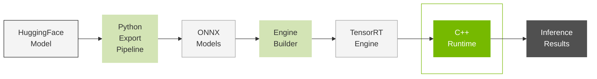

# C++ Runtime

**Part of**: [Key Components Series](03_Key_Components.md)  
**Previous**: [Engine Builder](03.2_Engine_Builder.md)

---

## Table of Contents

- [Overview](#overview)
- [Runtime Architecture](#runtime-architecture)
- [LLM Inference Runtime](#llm-inference-runtime)
- [LLM Inference SpecDecode Runtime](#llm-inference-specdecode-runtime)
- [Advanced Features](#advanced-features)
- [Performance Optimizations](#performance-optimizations)
- [Usage Examples](#usage-examples)

---

## Overview

The TensorRT Edge-LLM C++ Runtime provides a comprehensive inference system for Large Language Models (LLMs) and Vision Language Models (VLMs) built on top of TensorRT. The runtime implements a layered architecture that manages the autoregressive decoding loop required for language model inference, handling everything from tokenization to final text generation.

### Purpose

The C++ Runtime serves as the **final stage** in the TensorRT Edge-LLM workflow:





**Key Responsibilities**:
- Execute TensorRT engines for language model inference
- Manage autoregressive decoding loop
- Handle tokenization and detokenization
- Implement sampling strategies (greedy, top-k, top-p, temperature)
- Manage KV-cache for efficient generation
- Support multimodal processing (vision + text)
- Enable advanced features (LoRA, EAGLE, CUDA graphs)

### Location

- **Source**: `cpp/runtime/` directory
- **Examples**: `examples/llm/`, `examples/multimodal/`

---

## Runtime Architecture

The C++ runtime is organized around **two distinct, mutually exclusive runtime implementations** that serve different inference scenarios. Both runtimes share the same high-level API (`handleRequest`) but implement fundamentally different execution strategies:

<table style="border-collapse: collapse; width: 100%; border: 1px solid #e0e0e0;">
<tr>
<td style="border: 1px solid #e0e0e0; padding: 15px; text-align: center; width: 30%;">

**LLM Inference Runtime**

</td>
<td style="border: 1px solid #e0e0e0; padding: 15px;">

**Top-level orchestrator for standard and multimodal inference**  

Owns and coordinates all components for the inference pipeline. **Creates and directly manages a single `LLMEngineRunner` instance** (`mLLMEngineRunner`) that handles both prefill and generation phases. Manages memory allocation, request processing, tokenization, and response generation. Supports both text-only and multimodal (VLM) inference scenarios.

**Files**: `cpp/runtime/llmInferenceRuntime.{h,cpp}`

</td>
</tr>
<tr>
<td style="border: 1px solid #e0e0e0; padding: 15px; text-align: center;">

**LLM Inference SpecDecode Runtime**

</td>
<td style="border: 1px solid #e0e0e0; padding: 15px;">

**Specialized runtime for EAGLE speculative decoding**  

Completely separate from the LLM Inference Runtime, **owns and coordinates two distinct engine runners**: `mBaseEngineRunner` (LLMEngineRunner) and `mDraftEngineRunner` (EagleDraftEngineRunner). Implements sophisticated EAGLE tree-based speculative generation with draft model candidate generation and base model verification. Operates with batch size constraint of 1 and handles draft vocabulary mapping for EAGLE3.

**Files**: `cpp/runtime/llmInferenceSpecDecodeRuntime.{h,cpp}`

</td>
</tr>
</table>

---

## LLM Inference Runtime

The **LLM Inference Runtime** provides standard autoregressive generation for both text-only and multimodal (VLM) inference using a single `LLMEngineRunner`.

### Components Architecture

### Core Components

<table style="border-collapse: collapse; width: 100%; border: 1px solid #e0e0e0;">

<tr>
<td style="border: 1px solid #e0e0e0; padding: 15px; text-align: center; width: 25%;">

**LLM Engine Runner**

</td>
<td style="border: 1px solid #e0e0e0; padding: 15px;">

**Executes TensorRT engines and manages dual-phase inference**  

Core engine execution component owned by LLM Inference Runtime (as `mLLMEngineRunner`). Handles separate TensorRT execution contexts for prefill and generation phases. Manages its own Linear KV Cache instance, produces logits that are consumed by the runtime's sampling calls, and provides CUDA graph optimization for reduced latency. Supports dynamic LoRA adapter switching.

**Files**: `cpp/runtime/llmEngineRunner.{h,cpp}`

</td>
</tr>

<tr>
<td style="border: 1px solid #e0e0e0; padding: 15px; text-align: center;">

**Tokenizer**

</td>
<td style="border: 1px solid #e0e0e0; padding: 15px;">

**HuggingFace-compatible text tokenization system**  

Converts between text and token IDs using Byte-Pair Encoding (BPE). The LLM Inference Runtime owns its own tokenizer instance. Supports various model vocabularies (GPT, Llama, Qwen) with configurable special tokens and preprocessing steps.

**Files**: `cpp/tokenizer/tokenizer.{h,cpp}`, `preTokenizer.{h,cpp}`, `tokenEncoder.{h,cpp}`

</td>
</tr>

<tr>
<td style="border: 1px solid #e0e0e0; padding: 15px; text-align: center;">

**Multimodal Runner**

</td>
<td style="border: 1px solid #e0e0e0; padding: 15px;">

**Vision processing for multimodal models (VLMs)**  

Processes image inputs through Vision Transformer models and generates vision embeddings. Supports Qwen-VL and InternVL architectures with dynamic image token generation. Integrates vision embeddings with text tokens for multimodal inference.

**Files**: `cpp/multimodal/multimodalRunner.{h,cpp}`, `qwenViTRunner.{h,cpp}`, `internViTRunner.{h,cpp}`

</td>
</tr>

<tr>
<td style="border: 1px solid #e0e0e0; padding: 15px; text-align: center;">

**Linear KV Cache**

</td>
<td style="border: 1px solid #e0e0e0; padding: 15px;">

**Attention key-value cache management**  

The LLM Engine Runner maintains its own Linear KV Cache instance. Stores attention key-value pairs across inference steps for efficient autoregressive generation. Uses linear memory layout optimized for GPU access with support for batched processing and variable sequence lengths.

**Files**: `cpp/runtime/linearKVCache.{h,cpp}`

</td>
</tr>

<tr>
<td style="border: 1px solid #e0e0e0; padding: 15px; text-align: center;">

**Sampling Kernels**

</td>
<td style="border: 1px solid #e0e0e0; padding: 15px;">

**Token generation from model logits**  

Converts model output logits into probability distributions and samples the next token using configurable strategies (greedy, top-k, top-p, temperature). Called directly by the LLM Inference Runtime (not by engine runner) after engine execution produces logits. Operates on GPU for efficient batch processing.

**Files**: `cpp/sampler/sampling.{cu,h}`

</td>
</tr>

<tr>
<td style="border: 1px solid #e0e0e0; padding: 15px; text-align: center;">

**TRT Engine**

</td>
<td style="border: 1px solid #e0e0e0; padding: 15px;">

**TensorRT inference engine**  

Optimized TensorRT engine compiled from ONNX models. The LLM Inference Runtime uses a single engine loaded and executed by the LLM Engine Runner. Provides high-performance inference through TensorRT optimizations including kernel fusion, precision calibration, and memory optimization.

**Files**: Built by `llm_build` (see Engine Builder section)

</td>
</tr>

</table>

### Inference Workflow

The LLM Inference Runtime implements a dual-phase processing architecture optimized for autoregressive language model generation.

### Inference Phases

**Phase 1: Prefill Processing**

The prefill phase processes the entire input prompt in parallel to establish the initial inference state:

- **Input Processing**: Text is tokenized and padded to batch requirements
- **Multimodal Integration**: For VLMs, vision embeddings are processed through ViT components and integrated with text embeddings  
- **Parallel Execution**: All prompt tokens are processed simultaneously through transformer layers
- **KV-Cache Generation**: Key-value cache is populated for all prompt tokens
- **First Token Sampling**: Initial generated token is sampled from output logits

**Phase 2: Generation (Autoregressive Decode)**

The generation phase operates autoregressively, processing one token at a time:

- **Sequential Processing**: Each iteration processes the previously generated token
- **KV-Cache Reuse**: Leverages accumulated key-value cache from previous steps
- **CUDA Graph Optimization**: Optional CUDA graph capture reduces kernel launch overhead by 10-30%
- **Sampling Strategies**: Configurable token generation (greedy, top-k, top-p, temperature)
- **Stopping Criteria**: Continues until EOS token, maximum length, or custom conditions

---

## LLM Inference SpecDecode Runtime

The **LLM Inference SpecDecode Runtime** implements EAGLE speculative decoding using **dual engines** (draft and base) for accelerated token generation.

### Components Architecture

### Core Components

<table style="border-collapse: collapse; width: 100%; border: 1px solid #e0e0e0;">

<tr>
<td style="border: 1px solid #e0e0e0; padding: 15px; text-align: center; width: 25%;">

**LLM Engine Runner (Base)**

</td>
<td style="border: 1px solid #e0e0e0; padding: 15px;">

**Executes TensorRT engines and manages dual-phase inference**  

Core engine execution component owned by LLM Inference SpecDecode Runtime (as `mBaseEngineRunner`). Handles separate TensorRT execution contexts for prefill and generation phases. Manages its own Linear KV Cache instance, produces logits that are consumed by the runtime's sampling calls. **Note**: CUDA graph optimization is not available in EAGLE SpecDecode mode. Supports dynamic LoRA adapter switching.

**Files**: `cpp/runtime/llmEngineRunner.{h,cpp}`

</td>
</tr>

<tr>
<td style="border: 1px solid #e0e0e0; padding: 15px; text-align: center;">

**EAGLE Draft Engine Runner**

</td>
<td style="border: 1px solid #e0e0e0; padding: 15px;">

**Specialized engine runner for EAGLE draft models**  

Executes draft model inference for speculative decoding. Owned by LLM Inference SpecDecode Runtime (as `mDraftEngineRunner`). Generates candidate token sequences that are verified by the base model's LLMEngineRunner. Maintains its own separate KV cache and execution contexts optimized for draft model characteristics and tree-based token generation.

**Files**: `cpp/runtime/eagleDraftEngineRunner.{h,cpp}`

</td>
</tr>

<tr>
<td style="border: 1px solid #e0e0e0; padding: 15px; text-align: center;">

**Tokenizer**

</td>
<td style="border: 1px solid #e0e0e0; padding: 15px;">

**HuggingFace-compatible text tokenization system**  

Converts between text and token IDs using Byte-Pair Encoding (BPE). The LLM Inference SpecDecode Runtime owns its own tokenizer instance. Supports various model vocabularies (GPT, Llama, Qwen) with configurable special tokens and preprocessing steps.

**Files**: `cpp/tokenizer/tokenizer.{h,cpp}`, `preTokenizer.{h,cpp}`, `tokenEncoder.{h,cpp}`

</td>
</tr>

<tr>
<td style="border: 1px solid #e0e0e0; padding: 15px; text-align: center;">

**Multimodal Runner**

</td>
<td style="border: 1px solid #e0e0e0; padding: 15px;">

**Vision processing for multimodal models (VLMs)**  

Processes image inputs through Vision Transformer models and generates vision embeddings. Supports Qwen-VL and InternVL architectures with dynamic image token generation. Integrates vision embeddings with text tokens for multimodal inference.

**Files**: `cpp/multimodal/multimodalRunner.{h,cpp}`, `qwenViTRunner.{h,cpp}`, `internViTRunner.{h,cpp}`

</td>
</tr>

<tr>
<td style="border: 1px solid #e0e0e0; padding: 15px; text-align: center;">

**Linear KV Cache**

</td>
<td style="border: 1px solid #e0e0e0; padding: 15px;">

**Attention key-value cache management**  

Each engine runner maintains its own Linear KV Cache instance. Stores attention key-value pairs across inference steps for efficient autoregressive generation. Uses linear memory layout optimized for GPU access with support for batched processing and variable sequence lengths.

**Files**: `cpp/runtime/linearKVCache.{h,cpp}`

</td>
</tr>

<tr>
<td style="border: 1px solid #e0e0e0; padding: 15px; text-align: center;">

**Sampling Kernels**

</td>
<td style="border: 1px solid #e0e0e0; padding: 15px;">

**Token generation from model logits**  

Converts model output logits into probability distributions and samples the next token using configurable strategies (greedy, top-k, top-p, temperature). Called directly by the LLM Inference SpecDecode Runtime (not by engine runners) after engine execution produces logits. Operates on GPU for efficient batch processing.

**Files**: `cpp/sampler/sampling.{cu,h}`

</td>
</tr>

<tr>
<td style="border: 1px solid #e0e0e0; padding: 15px; text-align: center;">

**EAGLE Util Kernels**

</td>
<td style="border: 1px solid #e0e0e0; padding: 15px;">

**EAGLE speculative decoding utility kernels**  

Specialized CUDA kernels for EAGLE tree-based speculative decoding operations. Called directly by the LLM Inference SpecDecode Runtime (not by engine runners). Handles tree construction, candidate token generation, verification logic, and accept/reject mechanisms for speculative tokens.

**Files**: `cpp/kernels/speculative/`

</td>
</tr>

<tr>
<td style="border: 1px solid #e0e0e0; padding: 15px; text-align: center;">

**TRT Engines (Dual)**

</td>
<td style="border: 1px solid #e0e0e0; padding: 15px;">

**TensorRT inference engines**  

Optimized TensorRT engines compiled from ONNX models. The LLM Inference SpecDecode Runtime uses two separate engines (draft and base). Each engine is loaded and executed by its corresponding engine runner. Provides high-performance inference through TensorRT optimizations including kernel fusion, precision calibration, and memory optimization.

**Files**: Built by `llm_build` (see Engine Builder section)

</td>
</tr>

</table>

### Inference Workflow

### Inference Phases

**Phase 1: Base Model Prefill**

EAGLE starts with only the base model prefill:

- **Base Model Prefill**: Standard prefill using `LLMEngineRunner` to establish base model KV-cache
- **Hidden States Generation**: Base model produces hidden states required for draft model
- **Single Prefill**: Only base model is prefilled initially; draft model prefill happens later
- **Multimodal Integration**: Vision embeddings processed once and used by base model

**Phase 2: EAGLE Speculation Loop**

The generation phase uses iterative tree-based speculation with conditional draft prefill:

- **First Round Only**: Draft model prefill using `EagleDraftEngineRunner` with base model hidden states
- **Subsequent Rounds**: Draft model accept token operation instead of full prefill
- **Draft Tree Construction**: Draft model generates candidate token trees using top-k sampling from draft logits
- **Base Model Verification**: Base model processes entire draft tree in parallel and generates logits for all tree positions
- **EAGLE Accept Algorithm**: 
  - Base model's top-1 predictions are **always selected** as final tokens
  - Draft tree tokens are **accepted only when they match** base model predictions
  - When draft tokens diverge from base predictions, remaining draft tokens are **rejected**
  - Process continues following the draft tree path as long as tokens match
- **Token Generation Source**: All final output tokens come from base model, draft model only provides speculative candidates
- **No CUDA Graphs**: Unlike the LLM Inference Runtime, EAGLE does not support CUDA graph optimization
- **Iterative Process**: Continues until stop conditions or maximum generation length reached

**Key Differences from LLM Inference Runtime:**
- **Sequential Prefill**: Base model prefilled first, draft model prefilled only in first generation round
- **No CUDA Graph Support**: LLM Inference SpecDecode Runtime does not support CUDA graph optimization
- **Tree-Based Speculation**: Draft model constructs candidate token trees, base model always generates final tokens
- **Accept/Reject Mechanism**: Base model generates tokens during verification, draft tokens accepted only when they match
- **Batch Size Constraint**: Limited to batch size 1 only
- **Complex State Management**: Maintains separate KV caches and hidden states for both models

---

## Advanced Features

### CUDA Graph Optimization

The runtime provides sophisticated CUDA graph capture and execution for the generation phase (standard mode only):

**Graph Capture Process**:
- **Pre-execution**: TensorRT engine is executed once before graph capture to avoid errors
- **State Simulation**: KV-Cache state is simulated to match post-prefill conditions
- **Input Validation**: Tensor shapes and configurations are validated before capture
- **Graph Creation**: CUDA stream capture records the entire generation step execution
- **Hash-based Storage**: Graphs are stored with hash keys based on input shapes and LoRA configurations

**Graph Execution**:
- **Hash Lookup**: Input configurations are hashed to find matching pre-captured graphs
- **Direct Launch**: Matching graphs are launched directly via `cudaGraphLaunch`
- **Fallback Execution**: Non-matching configurations fall back to standard TensorRT execution
- **Multi-configuration Support**: Separate graphs captured for different batch sizes and LoRA adapters

### LoRA (Low-Rank Adaptation) Support

**LoRA (Low-Rank Adaptation)** is a parameter-efficient fine-tuning technique that adapts large language models by learning low-rank decomposition matrices rather than updating all model weights. Instead of modifying the original model parameters, LoRA adds small trainable rank decomposition matrices to existing layers, enabling task-specific customization with minimal memory overhead and computational cost.

The runtime provides comprehensive dynamic LoRA adapter management:

**Adapter Management**:
- **SafeTensors Loading**: LoRA weights loaded from industry-standard SafeTensors format
- **Dynamic Registry**: Multiple adapters managed with name-based identification
- **Rank Validation**: Adapter ranks validated against engine's maximum supported rank
- **GPU Memory Storage**: Efficient GPU memory allocation for adapter weights

**Runtime Switching**:
- **Zero-Rank Fallback**: Adapters disabled by setting rank dimensions to 0
- **Tensor Binding**: LoRA tensors bound to both prefill and generation execution contexts
- **CUDA Graph Integration**: Separate graph capture for each LoRA configuration
- **State Preservation**: KV-cache and model state maintained during adapter switches

**API Interface**:
- **`addLoraWeights(name, filePath)`**: Loads LoRA weights from SafeTensors files
- **`switchLoraWeights(name)`**: Switches active adapter or disables with empty name
- **`getAvailableLoraWeights()`**: Returns list of loaded adapters
- **`getActiveLoraWeightsName()`**: Returns currently active adapter name

### Batch Processing

The runtime supports efficient batch processing throughout the inference pipeline:

**Memory Management**:
- **Unified Allocation**: Batch-aware memory allocation reserves space for maximum batch size
- **Tensor Layouts**: Consistent tensor layouts support concurrent sequence processing
- **Dynamic Padding**: Input sequences padded to batch maximum length for parallel processing

**Execution Flow**:
- **Parallel Prefill**: All batch sequences processed simultaneously during prefill
- **Concurrent Generation**: Tokens generated for all active sequences in each iteration
- **Individual Tracking**: Each sequence maintains independent completion state
- **Dynamic Removal**: Completed sequences removed from batch as they finish

### System Prompt KV-Cache Optimization

The runtime implements intelligent caching for repeated system prompts:

**Cache Management**:
- **Hash-based Storage**: System prompts cached using combined hash of prompt and LoRA adapter
- **KV-Cache Persistence**: Key-value cache content saved and reused for identical system prompts
- **Memory Efficiency**: Avoids recomputing prefill for repeated system prompt patterns
- **Automatic Reuse**: Cache automatically detected and loaded for matching prompts

**Performance Benefits**:
- **Reduced Latency**: Eliminates prefill computation for cached system prompts
- **Memory Optimization**: Efficient storage of frequently used prompt states
- **Batch Compatibility**: Cache reuse works seamlessly with batch processing

### Multimodal Processing

The runtime provides comprehensive support for Vision Language Models (VLMs):

**Vision Processing Pipeline**:
- **Image Preprocessing**: Normalization, resizing, and tensor conversion for vision inputs
- **ViT Execution**: Vision Transformer models process images to generate embeddings
- **Token Integration**: Vision embeddings integrated with text tokens before LLM processing
- **Dynamic Resolution**: Support for variable image resolutions and patch counts

**Supported Architectures**:
- **Qwen-VL Series**: Qwen2-VL and Qwen2.5-VL with dynamic image patches and window attention
- **InternVL Series**: InternVL3 with 0.5 downsampling ratio and fixed image size processing
- **Rotary Position Encoding**: Advanced positional encoding for multimodal sequences

---

## Performance Optimizations

### Memory Efficiency

- **Linear KV-Cache Layout**: Optimized memory layout for GPU access patterns
- **Tensor Reuse**: Efficient tensor reuse across inference iterations
- **Batch Optimization**: Memory allocation patterns minimize overhead across batch elements

### Compute Optimization

- **CUDA Graph Capture**: Reduces kernel launch overhead in generation phase
- **Dual-Phase Profiles**: Separate optimization for prefill and generation characteristics
- **Hardware-Specific Kernels**: Custom CUDA kernels optimized for target GPU architectures

### Latency Reduction

- **First Token Latency**: Prefill processing optimized through parallel execution
- **Inter-Token Latency**: Generation phase efficiency with CUDA graph support
- **System Prompt Caching**: Eliminates redundant computation for repeated prompts

---

## Usage Examples

### Standard LLM Inference

```cpp
#include "llmInferenceRuntime.h"

// Initialize runtime
LLMInferenceRuntime runtime(engineDir);

// Prepare request
InferenceRequest request;
request.inputText = "What is the capital of France?";
request.maxLength = 100;
request.temperature = 0.7;

// Execute inference
auto response = runtime.handleRequest(request);
std::cout << "Generated: " << response.outputText << std::endl;
```

### EAGLE Speculative Decoding

```cpp
#include "llmInferenceSpecDecodeRuntime.h"

// Initialize runtime with base and draft models
LLMInferenceSpecDecodeRuntime runtime(baseModelDir, draftModelDir);

// Execute inference
InferenceRequest request;
request.inputText = "Explain quantum computing.";
request.maxLength = 200;

auto response = runtime.handleRequest(request);
std::cout << "Generated: " << response.outputText << std::endl;
```

### LoRA Adapter Switching

```cpp
// Load LoRA adapters
runtime.addLoraWeights("medical", "lora_weights/medical_adapter.safetensors");
runtime.addLoraWeights("legal", "lora_weights/legal_adapter.safetensors");

// Use medical adapter
runtime.switchLoraWeights("medical");
auto medical_response = runtime.handleRequest(medical_request);

// Switch to legal adapter
runtime.switchLoraWeights("legal");
auto legal_response = runtime.handleRequest(legal_request);

// Disable LoRA
runtime.switchLoraWeights("");
auto base_response = runtime.handleRequest(base_request);
```

### Multimodal VLM Inference

```cpp
// Initialize multimodal runtime
LLMInferenceRuntime runtime(engineDir, visualEngineDir);

// Prepare multimodal request
InferenceRequest request;
request.inputText = "What's in this image?";
request.imagePaths = {"image.jpg"};
request.maxLength = 150;

auto response = runtime.handleRequest(request);
std::cout << "Generated: " << response.outputText << std::endl;
```

---

## Best Practices

### Runtime Configuration

1. **Choose appropriate runtime**: Standard for normal inference, SpecDecode for EAGLE
2. **Configure batch size**: Match your workload requirements
3. **Enable CUDA graphs**: For consistent workloads with standard runtime
4. **Pre-load LoRA adapters**: For faster switching during inference

### Performance Tuning

1. **System Prompt Caching**: Use for repeated prompts to reduce latency
2. **Batch Processing**: Group requests for better throughput
3. **Memory Management**: Monitor GPU memory usage and adjust batch sizes
4. **Sampling Parameters**: Balance quality and speed with temperature/top-k/top-p

### Production Deployment

1. **Error Handling**: Implement robust error handling for production
2. **Monitoring**: Track latency and throughput metrics
3. **Resource Management**: Properly manage GPU memory and cleanup

---

## Next Steps

1. **Try Examples**: Run the [Examples](04_Examples.md) to see the runtime in action
2. **Benchmark Performance**: Measure latency and throughput for your use case
3. **Integrate into Application**: Use the runtime API in your application
4. **Optimize for Production**: Apply best practices for deployment

---

## Additional Resources

- **Runtime API**: See `cpp/runtime/` directory
- **Example Applications**: See `examples/llm/` and `examples/multimodal/`
- **Performance Benchmarks**: Run `llm_benchmark` and `vlm_benchmark` examples
- **Architecture Overview**: See [Key Components](03_Key_Components.md)

