# Overview

> **Repository:** [github.com/NVIDIA/TensorRT-Edge-LLM](https://github.com/NVIDIA/TensorRT-Edge-LLM)

## What is TensorRT Edge-LLM?

TensorRT Edge-LLM is NVIDIA's high-performance C++ inference runtime for Large Language Models (LLMs) and Vision-Language Models (VLMs) on embedded platforms. It enables efficient deployment of state-of-the-art language models on resource-constrained devices like NVIDIA Jetson and DRIVE platforms.

## Key Features

- **🚀 High Performance**: Optimized CUDA kernels and TensorRT integration for maximum throughput
- **💾 Memory Efficient**: Advanced KV cache management and quantization support (FP8, INT4)
- **🔄 Production Ready**: C++-only runtime with no Python dependencies
- **🎯 Edge Optimized**: Designed specifically for embedded and automotive platforms
- **🔧 Flexible**: Support for LoRA adapters, speculative decoding, and multimodal models
- **📊 Complete Toolkit**: Python export pipeline, engine builder, and runtime in one package

## Key Components

> **Code Location:** [`tensorrt_edgellm/`](../../tensorrt_edgellm/) (Python), [`cpp/`](../../cpp/) (C++), [`examples/`](../../examples/) (Examples)

TensorRT Edge-LLM uses a three-stage pipeline:

```mermaid
%%{init: {'themeVariables': {'edgeLabelBackground': 'white'}}}%%

graph LR
    HF_MODEL[Autoregressive Models<br>*e.g. HuggingFace*]
    PYTHON_EXPORT(Python Export Pipeline)
    ONNX_MODEL[ONNX<br>Model]
    ENGINE_BUILDER(Engine Builder)
    TRT_ENGINE[TensorRT<br>Engines]
    CPP_RUNTIME(C++ Runtime)
    SAMPLES(Examples)
    APPLICATIONS(Applications)

    HF_MODEL --> PYTHON_EXPORT
    PYTHON_EXPORT --> ONNX_MODEL
    ONNX_MODEL --> ENGINE_BUILDER
    ENGINE_BUILDER --> TRT_ENGINE
    TRT_ENGINE --> CPP_RUNTIME
    CPP_RUNTIME --> SAMPLES
    SAMPLES --> APPLICATIONS

    classDef greyNode fill:#f4f4f4, stroke-width:0px
    classDef nvNode fill:#76B900, stroke-width:0px, color:#ffffff
    classDef darkNode fill:#505050, stroke-width:0px, color:#ffffff
    classDef inputNode fill:#f4f4f4, stroke: #202020
    classDef itemNode fill:#f4f4f4, stroke: #A0A0A0
    classDef greenSubGraph fill:#ffffff, stroke:#76B900

    class HF_MODEL inputNode
    class ONNX_MODEL,TRT_ENGINE itemNode
    class PYTHON_EXPORT,ENGINE_BUILDER,CPP_RUNTIME nvNode
    class APPLICATIONS darkNode
    class SAMPLES nvNode
    class BUILD_ENV_1,BUILD_ENV_2 greenSubGraph
```

<table class="simple-table">
<tr>
<td class="component-table-cell">

</td>
<td class="simple-table-cell">

Python-based toolchain that converts HuggingFace models into ONNX format with quantization (FP8, INT4, NVFP4)  
[Details →](03.1_Python_Export_Pipeline.md)

</td>
</tr>
<tr>
<td class="component-table-cell">

</td>
<td class="simple-table-cell">

C++-based application that compiles ONNX models into optimized TensorRT engines  
[Details →](03.2_Engine_Builder.md)

</td>
</tr>
<tr>
<td class="simple-table-cell-center">

</td>
<td class="simple-table-cell">

C++-based runtime that executes TensorRT engines with CUDA graphs, LoRA, and EAGLE support  
[Details →](04.1_C++_Runtime_Overview.md)

</td>
</tr>
<tr>
<td class="simple-table-cell-center-last">

</td>
<td class="simple-table-cell-last">

Reference implementations demonstrating LLM, multimodal, and utility use cases  
[Details →](05_Examples.md)

</td>
</tr>
</table>

## Use Cases

TensorRT Edge-LLM is ideal for:

**🚗 Automotive**
- In-vehicle AI assistants
- Voice-controlled interfaces
- Scene understanding and description
- Driver assistance systems

**🤖 Robotics**
- Natural language interaction
- Task planning and reasoning
- Visual question answering
- Human-robot collaboration

---

## Supported Platforms

### Hardware Platforms

| Platform | Software Release | Link |
|----------|------------------|------|
| NVIDIA Jetson Thor | JetPack 7.1 | Upcoming |
| NVIDIA DRIVE Thor | DriveOS 7 | For details see DriveOS 7 release documentation |

> **Note:** The platforms listed above are officially supported and tested. While TensorRT Edge-LLM may run on other NVIDIA GPU platforms (e.g., discrete GPUs, other Jetson devices), these are not officially supported but may be used for experimental purposes.

### Software Requirements

**Operating Systems:**
- **JetPack 7.1** (for Jetson Thor)
- **DRIVE OS** (for DRIVE Thor)

**C++ Runtime Dependencies:**
- CUDA 13.x (included in JetPack 7.1 / DRIVE OS)
- TensorRT 10.x+ (included in JetPack 7.1 / DRIVE OS)
- C++17 compiler (GCC 11+)

**Python Dependencies** (for export pipeline - run on x86 host):
- Python 3.8+
- PyTorch 2.8.0
- Transformers 4.55.2
- NVIDIA ModelOpt 0.35.0
- ONNX 1.18.0
- Datasets 4.0.0
- NumPy 2.3.0
- tqdm 4.67.1

### Supported Model Families

**Large Language Models:**
- Llama 3.x (3B, 8B)
- Qwen 2/2.5/3 (0.5B - 7B)
- DeepSeek-R1 Distilled (1.5B, 7B)

**Vision-Language Models:**
- Qwen2/2.5-VL (2B, 3B, 7B)
- InternVL3 (1B, 2B)

See [Supported Models](02_Supported_Models.md) for complete list.

---

## Next Steps

1. **[Quick Start Guide](1.2_Quick_Start_Guide.md)**: Get up and running in 15 minutes
2. **[Installation](1.3_Installation.md)**: Detailed installation instructions
3. **[Supported Models](02_Supported_Models.md)**: Learn about supported models

---

**For questions or issues, please visit our [GitHub repository](https://github.com/NVIDIA/TensorRT-Edge-LLM).**

