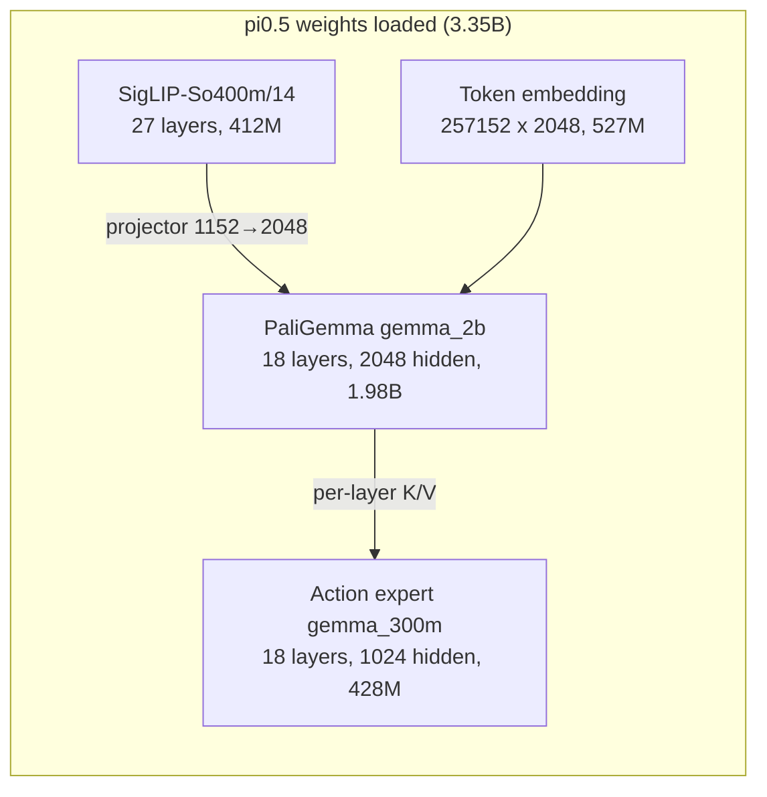
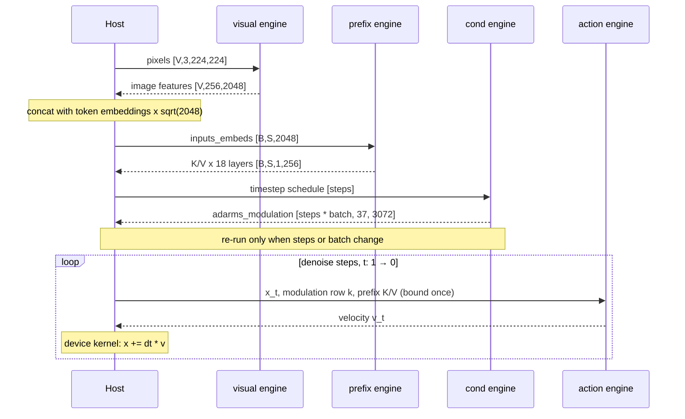

# pi0.5 Design

[pi0.5](https://www.physicalintelligence.company/blog/pi05) is a flow-matching Vision-Language-Action
model, not an autoregressive decoder: each denoising step predicts a velocity, while tokens appear
only in the input prompt, including the discretized state for `pi05_droid` and `pi05_aloha`.

The action expert predicts velocity through `action_out_proj` rather than token logits, so its
263M-parameter `lm_head` is unused and dropped at export. The two towers share `head_dim` (256) and
`num_key_value_heads` (1), because the expert attends over the *concatenation* of the prefix K/V and
its own.

Edge-LLM runs it as `visual`, `prefix`, `action` and an optional `cond` component behind
`pi05_policy_inference`. See the [pi0.5 example](../../user_guide/examples/vla/pi05.md) for export,
build and inference commands.

The three main components are split by execution frequency: `visual` and `prefix` run once per
request, `action` once per denoise step, which is what leaves the step count a runtime setting.

`cond` is a fourth, optional component, exported by default. It moves the time embedder and the 37
`[3072, 1024]` AdaRMS Denses (232.8 MB fp16) out of the per-step graph; no weights are duplicated,
they move. The runtime re-evaluates it only when the denoise-step count or the batch changes, so it
is not per-request work. `--no-pi05-hoist-adarms-cond` exports without it, and a bundle whose
`action/config.json` omits `hoisted_adarms_cond` is read as not hoisted, which is how a
three-engine export from the same contract version loads.

## Checkpoint

Two config schemas ship the same weights: openpi's converter writes `action_dim` / `action_horizon`,
the LeRobot release `max_action_dim` / `n_action_steps`. Neither carries a `model_type`, and
`paligemma_variant` / `action_expert_variant` exist in pi0 too, so the architecture is resolved from
the **weight signature**: pi0.5 has `time_mlp_in`/`time_mlp_out` and adaRMS expert norms, pi0 has
`state_proj`. A checkpoint carrying both is rejected rather than guessed at.

Gemma ties `lm_head` to the token embedding and `safetensors.save_model` deduplicates tied tensors,
so the table usually survives only as `...paligemma.lm_head.weight`. Both spellings are accepted.

`norm_stats.json` carries both `mean`/`std` and `q01`/`q99`. openpi settles which pair applies by
model type -- `use_quantile_norm` is `model_type != PI0` -- so every pi0.5 configuration is quantile
normalized regardless of embodiment. It is not a per-bundle choice, so `policy.json` does not carry
one and only `q01`/`q99` are read; the load-time check is that they cover the declared dims.
Supporting LeRobot's mean/std would mean adding the mode, the statistics and both branches back,
not reinterpreting a field.

## Where the policy contract comes from

The weights and the policy semantics have different authorities, and conflating them is the
easiest way to ship a plausible but wrong policy.

| Part | Source |
|---|---|
| `model.safetensors` | Hugging Face mirror, as a distribution channel |
| Architecture and weight mapping | openpi pi0.5 |
| Action horizon, camera slots, prompt transform, normalization | the openpi configuration named by `policy_config` |
| Correctness reference | openpi's `policy.infer()` |
| Tokenizer | the PaliGemma SentencePiece model openpi loads |

`lerobot/pi05_libero_base` mirrors the weights, but it also ships `policy_preprocessor.json`,
`policy_postprocessor.json` and a `chunk_size` / `n_action_steps` pair describing **LeRobot's own**
policy: mean/std normalization and a discretized state written into the prompt. openpi's
`pi05_libero` uses quantile normalization and sets `discrete_state_input` to `False`, so its prompt
is the task text and a lone newline; pi0.5 carries no state projection either, so under that
configuration the state reaches the model through neither path.

The exporter therefore takes only the model ABI from the checkpoint -- the padded action width and
the image resolution -- and every robot-facing dimension from `OPENPI_POLICY_CONTRACTS`, so the
manifest and the engines cannot end up describing different policies. The mirror's own processor
files are not read at all.

| | `pi05_libero` | `pi05_droid` | `pi05_aloha` |
|---|---|---|---|
| state / robot action | 8 / 7 | 8 / 8 | 14 / 14 |
| action horizon | 10 | 15 | 50 |
| `discrete_state_input` | false | true | true |
| camera slots | two, required | two, required | `cam_high` required, both wrists optional |
| accepted and dropped | -- | -- | `cam_low` |
| profile `opt_views` | 2 | 2 | 3 |

The policy configuration cannot generally be inferred. `pi05_libero` is auto-detected from its
unique feature contract; DROID and ALOHA must be named explicitly. The horizon is what makes that
matter: building the action graph at the wrong H produces a bundle that loads and runs.
`pi05_aloha` in particular is an inference contract over the generalist `pi05_base` weights rather
than a checkpoint of its own.

The checkpoint is not silent about the horizon, though: it records `n_action_steps`, which agrees
with openpi for all three (10 / 15 / 50). That is not taken as the source -- the configuration
remains the authority -- but a pairing whose two horizons disagree is refused before anything is
built, since all three pad actions to 32 dims and would otherwise export, build and run while
emitting wrong commands. `chunk_size` is a different number, 50 on LIBERO's 10-step configuration,
and is not read.

Using the mirror is safe for the LIBERO weights by direct comparison: sampled tensors were checked
against `gs://openpi-assets/checkpoints/pi05_libero` and agree in fp32, the token embedding to
within one bf16 round-trip, which is what openpi's converter produces at its default precision. No
such tensor comparison was run for the DROID and ALOHA mirrors; what stands behind those is the
end-to-end parity against openpi's own policy below.

## Component contract

Each component directory carries a `config.json`. The builder takes the optimization profile
entirely from its `optimization_profile`, validates `min <= opt <= max`, and rejects an entry naming
a tensor the graph does not declare. `tensor_contract` records each tensor's dtype and rank for
readers and for diffing two exports; nothing in the builder or the runtime reads it, so it documents
the I/O rather than enforcing it.
A bundle also carries a `contract_version`; one this runtime does not implement is refused up
front, naming both versions, rather than failing inside the ONNX parser.

What the names do not tell you:

| Tensor | Component | What it means |
|---|---|---|
| `inputs_embeds` | prefix | `[image features ++ token embeddings x sqrt(hidden_size)]`, assembled by the caller. |
| `attention_pos_id` | prefix, action | Indexes **into** the supplied cos/sin table, so a suffix offset belongs in the table slice, not in the ids. |
| `kv_cache_layerNN` | action | The paged pool, `[2, num_pages, 128, H_kv, D]`; `present_kv_cache_layerNN` is the same memory. |
| `attention_sequence_lengths` | action | Filled length **after** the append, int32 `[B]`; the plugin writes the action tokens into the slots just below it. |
| `query_lengths` | action | Rows this request contributes, int32 `[B]`, always the action horizon. Distinct from the line above. |
| `query_start_offsets` | action | Prefix sum of the above, int32 `[B + 1]`. |
| `execution_phase_marker` | action | Shape-only: the extent is `rt::ExecutionPhase::kDiffusionDenoise`, which with tree attention on selects the tree kernel. The payload is never read. |
| `context_sequence_count_carrier` | action | Shape-only, bound empty: a denoise step never prefills. |
| `attention_mask` | action | Bit-packed, `[B * H, ceil(H/32)]`; the runtime supplies all ones. |
| `adarms_modulation` | cond | Rows are `[step][request]`, so the tensor is `[num_steps * batch, 37, 3072]` and the step count is capped by `builder_config.max_denoise_steps`. Within a row, `2i` is layer `i`'s `input_layernorm`, `2i + 1` its `post_attention_layernorm`, the last the final `norm`; the last axis packs `(scale, shift, gate)`. |
| `action_pred` | action | The **velocity**, not the updated chunk. |

Two invariants the prefix graph relies on and cannot check:

1. **The prefix is compact.** Attention is bidirectional and carries no mask, so a masked-out camera
   view or a padded language token must not be emitted at all. Dropping them is equivalent to
   openpi's masking because `position_ids = cumsum(pad_mask) - 1` skips masked positions either way.
2. **The `sqrt(hidden_size)` embedding scale is applied exactly once, by the caller.** openpi applies
   it in `embed_prefix` and comments out the tower's own normalizer.

Export identity, in five rules:

- `policy.json` and every component `config.json` carry one shared `export_id`, hashed from the
  checkpoint's weight fingerprint and the export options. Components from different exports pass
  every shape check while their towers disagree on weights, so both the builder and `Pi05Policy`
  reject a set whose ids disagree.
- An export or engine directory must be **empty, or already hold this one export**. Re-exporting or
  rebuilding a subset of it keeps working; anything else is refused before a byte moves.
- `export_id` does not cover the processor pair or the feature contract `policy.json` is derived
  from, so a partial re-export also compares the manifest it would write against the one already
  staged -- before any output artifact is modified -- and refuses a change to `policy_config`,
  `state`, `action`, `cameras`, `image_resolution` or `tokenizer`.
- `policy_config` comes from `--pi05-policy-config`, or from a feature contract that names exactly
  one configuration. Neither a directory name nor a `repo_id` string is evidence of one, and it is
  part of the export options `export_id` hashes, so two configurations cannot share a bundle.
- This refuses mixing that is *detectable*, not every mixing. `assets/` and `text_tokenizer/` carry
  no identity, and the documented flow stages `norm_stats.json` after the export that would vouch
  for it, so statistics edited in place still load.

## Attention and the K/V pool

The prefix is **fully bidirectional** -- PaliGemma is a prefix-LM and its `att_masks` are all zeros
-- which none of `attentionPlugin`'s causal, sliding or vision-block masks expresses. `visual`,
`prefix` and `cond` therefore use TensorRT-native ops (`trt::Attention` with `is_causal=False` and no
mask, `trt::RotaryEmbedding`) and carry no Edge-LLM plugin node.

The **expert** is the exception: it runs on the shared `trt_edgellm::AttentionPlugin` in tree-decoding
mode, under an all-ones mask, with explicit position ids and the sliding window off. That mode fuses
the Q/K/V split, the Q/K RoPE and the cache write into one preprocessing kernel ahead of XQA.

The pool is **plane-major**: every request's K pages, then every request's V pages. Each request
occupies `builder_config.kv_cache_capacity / 128` consecutive pages, and the capacity is
`max_prefix_len + action_horizon` rounded up to XQA's 256-key CTA tile. `max_prefix_len` covers all
three image slots whatever the configuration feeds, so it is 976 throughout and only the horizon
moves: 1024 for LIBERO and DROID, 1280 for ALOHA's 50. Three constraints hold that layout together,
and breaking any of them is silent rather than fatal:

- **`H_kv` must be 1.** Only then is a contiguous run of pages under an identity page table
  byte-identical to a flat `[capacity, D]` region, which is what lets the prefix tower write its
  `[B, S, 1, D]` output straight into the pool instead of being repacked per step. The runner
  rejects anything else at load, and rejects an action export whose `builder_config` does not say
  `paged_kv_cache`.
- **The V plane begins past every slot's K**, not past slot 0's. `prefill()` and `scatterPrefixKV()`
  take that offset from one place for that reason.
- **The expert's head fold is exact only under the all-ones mask.** It folds its eight query heads
  into the row axis of the single K/V head so TensorRT never replicates K/V; that identity needs
  every action token to attend to every other and to the whole prefix.

The plugin appends the action tokens' K/V into slots `[prefix_len, prefix_len + H)` and declares the
write as `present_kv_cache_layerNN`, which the runtime binds to the input's address with the alias
left undeclared so Myelin keeps no per-layer copy.

## Runtime boundary

Two API layers split on whether a decision is numerically part of the checkpoint's contract.

`Pi05Runtime` owns the prefix tower and the K/V cache it fills, and drives the vision tower
(`Pi05VisualRunner`) and the flow-matching loop (`Pi05ActionRunner`) over that cache. It takes
canonical tensors and returns a normalized, zero-padded `[B, H, 32]` chunk; it knows no camera names,
no robot action width and no embodiment. All three run on the stream given to the runtime's
constructor, and none is thread-safe.

`Pi05Policy` owns everything `policy.json` describes, from camera order through action
unnormalization. A configuration it does not implement is refused at load rather than run, since a
foreign bundle would produce plausible commands that are wrong. A robot or simulator adapter belongs
above this boundary, not in either class.

Three things stay on the host rather than in the graphs, because baking them in would pin a
compile-time choice the runtime should keep: the 527M **token embedding**, a sidecar the runtime
gathers and scales on device; **prefix assembly**, which is also what compacts it; and the **Euler
update**, whose device kernel keeps the step count a runtime knob. Policy pre/post-processing is
manifest-driven where the shapes allow -- an embodiment whose action horizon or camera count differs
still needs its own export and engines, since those are fixed in every profile entry and only the
batch axis is dynamic.

`buildPrompt()` follows the manifest's `discrete_state_input`. Under openpi's `pi05_libero` that is
`False`, so the prompt is the task text and a lone newline, matching its `TokenizePrompt`. DROID and
ALOHA set it, and emit `Task: <task>, State: <bins>;\nAction: ` over the normalized state
discretized into 256 bins; a dimension outside `[-1, 1)` carries the reference's own out-of-range
bin `-1` rather than being clamped.

## Embodiment adapters

`Pi05Adapter` selects the two conversions that are not shared, and nothing below `Pi05Policy` sees
it. Quantile normalization is common to all three and follows openpi exactly, epsilon included:
`(x - q01) / (q99 - q01 + 1e-6) * 2 - 1`, inverted on the way out. The epsilon is part of the
reference formula, not a guard against a degenerate spread.

LIBERO and DROID stop there: the state passes through and the chunk is unnormalized and sliced to
the robot's width. ALOHA is the exception, and its steps only compose in openpi's order:

| | input | output |
|---|---|---|
| 1 | joint sign flips | unnormalize |
| 2 | both grippers linear -> angular | absolute actions: add the adapted state to the twelve arm joints |
| 3 | quantile normalize | joint sign flips |
| 4 | discretize into the prompt | both grippers angular -> robot |

Step 2 on the output side is why a robot-unit chunk exists only behind `infer()`: it reads the
request's own state, which canonical tensors do not carry. The grippers stay absolute in that step,
matching openpi's delta mask, and are converted last.

## Precision and validation

**FP16 only.** The graphs are exported in fp16 with plain `nn.Linear`; there is no quantization
dispatch (`make_linear` / `QuantConfig`) in `tensorrt_edgellm.models.pi05`. Adding FP8 or NVFP4 also
needs a decision for the expert's attention, which the export drives with
`enable_fp8_kv_cache=False` and identity Q/K/V scales.

The reference is openpi's own policy for the configuration under test, in fp32, so the comparison
covers the transforms as well as the engine maths.

### What the thresholds mean

`compare_pi05_actions.py` gates all three configurations at its defaults, `0.99999` cosine and
`5e-3` max-abs. All three cleared them on the validated build, each scored on an observation from
its own embodiment; the paragraph below is why a rebuild can land the other side of the ceiling.

Score each configuration on its own embodiment's frames. On another embodiment's, the same engines
run several times looser -- off-manifold the ten-step integration compounds per-step error instead
of damping it -- so a cross-embodiment number is a shape-level smoke test, not accuracy. What
remains in distribution is fp16 deviation plus build variance: TensorRT picks fp16 or fp32
accumulation per GEMM during code generation and exposes no control over it, so the same ONNX
rebuilt can move max-abs severalfold.

Four tensors have to come from the reference run, because `x_0` cannot be shared through a
seed: the two implementations draw from different RNGs.

| file | what | where it comes from |
|---|---|---|
| `pixel_values.bin` | fp16 `[views, 3, S, S]`, raw bytes | the `image` entries of `Policy._input_transform(obs)`, in contract camera order |
| `token_ids.csv` | the tokenized prompt | `tokenized_prompt` from the same transform |
| `x0.bin` | fp32 `[horizon, action_dim]` initial noise | drawn once and passed to `Policy.infer(obs, noise=x0)` |
| `actions.npy` | the **normalized** chunk | captured immediately before openpi's output transform |

`Policy.infer` returns robot units while the CLI writes the normalized chunk, so score either
openpi's pre-transform chunk against the CLI output, or its post-transform chunk against
`--json-field robot_actions`.

A request runs the cameras it supplies and no others. The model carries three image slots; a slot
the configuration masks out -- LIBERO's third, DROID's right wrist, an ALOHA wrist a request omits --
gets no RoPE position in the reference either, so dropping it is the same computation with one
vision-tower pass and 256 prefix tokens less. Canonical tensor mode will accept the full three-slot
shape as well, but this runtime masks nothing -- those views attend and shift every language position
after them -- so that shape is a shape-level benchmark, never a parity run.
